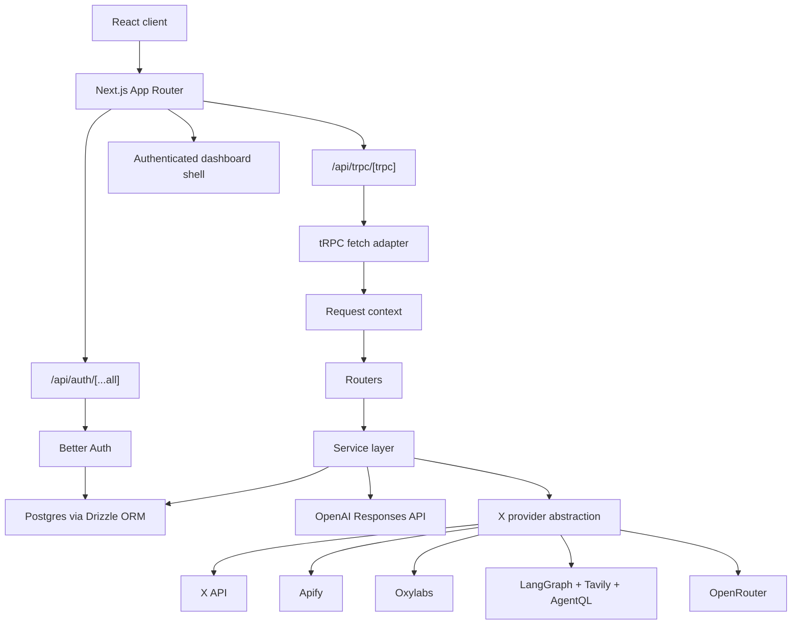

# Current Architecture

## 1. What this project is

`skaleai` is an authenticated Next.js application for X/Twitter lead discovery and outreach preparation.

The current codebase is centered around a single operational loop:

1. Discover relevant X accounts from a niche query or a seed account.
2. Save those accounts as leads inside projects.
3. Score and enrich the leads with tweet metrics and AI signals.
4. Move selected leads into an outreach queue.
5. Generate and manage outreach templates.
6. Use AI to create new shortlist projects from existing projects.

The product is not a general CRM and not a generic social analytics tool. It is a focused workflow app for sourcing and managing X/Twitter outreach targets.

## 2. System shape



## 3. Stack

### Runtime and framework

- Next.js 16 App Router
- React 19
- TypeScript in strict mode
- Bun scripts for tests and DB commands

### API and validation

- tRPC v11
- Zod
- SuperJSON

### Database and auth

- Postgres
- Drizzle ORM
- Better Auth

### UI

- Tailwind CSS 4
- `@base-ui/react`
- local UI components under `src/components/ui`

### AI and external providers

- OpenAI Responses API
- X API
- Apify
- Oxylabs
- Tavily
- AgentQL
- LangGraph
- OpenRouter

## 4. Repository structure

### `src/app`

Purpose: route tree, layouts, landing/auth pages, and route handlers.

- `(auth)` contains sign-in / sign-up pages and server actions.
- `(main)` contains protected product pages.
- `api/auth/[...all]` exposes Better Auth.
- `api/trpc/[trpc]` exposes the tRPC adapter.

### `src/components`

Purpose: page workspaces, stateful page hooks, provider-selection UI, sidebar shell, and shared UI primitives.

Notable folders:

- `search`
- `leads`
- `outreach`
- `projects`
- `settings`
- `providers`
- `sidebar`
- `ui`

### `src/server/trpc`

Purpose: API composition.

- `context.ts` builds request-scoped auth + provider context.
- `trpc.ts` defines `router`, `publicProcedure`, and `protectedProcedure`.
- `root.ts` composes all routers.
- `routers/*.ts` bind procedure inputs to service calls.

### `src/server/services`

Purpose: business logic and DB workflows.

- projects
- search
- leads
- stats
- analysis
- outreach
- outreach-templates
- api-keys
- project-runs
- provider-comparison

### `src/lib`

Purpose: shared helpers, auth config, provider integrations, AI helpers, validation, and client infrastructure.

Key folders/files:

- `auth.ts`
- `openai.ts`
- `x/*`
- `trpc/*`
- `validations/*`
- `constants.ts`

### `src/db`

Purpose: schema, migrations, and DB connection bootstrap.

## 5. Request lifecycle

### Client to server

1. Client code uses the React Query + tRPC client from `src/lib/trpc/react.tsx`.
2. `httpBatchLink` sends requests to `/api/trpc`.
3. The selected X provider is forwarded in the `x-data-provider` header.
4. `src/app/api/trpc/[trpc]/route.ts` passes the request into `fetchRequestHandler`.
5. `createContext()` resolves:
   - Better Auth session
   - `userId`
   - current `xDataProvider`
6. The tRPC router dispatches to a protected procedure.
7. The router validates input and calls a service.
8. The service talks to Drizzle, OpenAI, and/or the X provider layer.
9. Results are serialized with SuperJSON and returned to the client.

### Auth flow

1. Auth forms submit to server actions in `src/app/(auth)/actions.ts`.
2. Actions validate input with Zod via `validatedAction`.
3. Better Auth handles session issuance and cookie management.
4. Protected layouts re-check the session through `auth.api.getSession`.

## 6. Database model

### Auth tables

- `user`
- `session`
- `account`
- `verification`

These are managed through Better Auth + Drizzle.

### App tables

#### `projects`

Stores user-owned project containers.

Fields:

- `id`
- `userId`
- `name`
- `query`
- `seedUsername`
- `createdAt`

#### `leads`

Stores CRM-like lead records for X profiles.

Key properties:

- X identity: `xUserId`, `handle`, `profileUrl`, `avatarUrl`
- profile data: `name`, `bio`, `followers`, `following`
- CRM state: `stage`, `priority`, `dmComfort`, `theAsk`, `inOutreach`
- enrichment: `email`, `budget`
- discovery metadata: `discoverySource`, `discoveryQuery`

Uniqueness:

- unique on `userId + handle + platform`

#### `project_leads`

Join table between projects and leads.

#### `project_runs`

Stores provider-run metadata per project workflow.

Fields include:

- `requestKey`
- `operationType`
- `requestedProvider`
- `discoveryProvider`
- `lookupProvider`
- `networkProvider`
- `tweetsProvider`
- `query`
- `seedUsername`
- `leadCount`

#### `post_stats`

Cached tweet metrics per lead.

Metrics:

- `postCount`
- `avgViews`
- `avgLikes`
- `avgReplies`
- `avgReposts`
- `topTopics`

#### `outreach_templates`

Saved outreach templates for a user.

#### `api_keys`

Stores hashed API keys, prefixes, and usage timestamps.

## 7. tRPC router surface

### `projectsRouter`

- `list`
  Returns lightweight project rows plus source provider information.
- `overviews`
  Returns project cards with aggregated metrics and preview leads.
- `create`
  Inserts a new project.
- `delete`
  Deletes a project owned by the user.
- `queueAllLeads`
  Sets all leads in a project to `inOutreach = true`.
- `analyze`
  Runs AI analysis across selected projects and creates a new shortlist project.

### `leadsRouter`

- `list`
  Returns paginated leads with filters.
- `update`
  Updates one lead.
- `bulkUpdate`
  Applies one patch to many leads.
- `remove`
  Deletes one lead.
- `enrichEmails`
  Stubbed placeholder, currently returns `0`.
- `scanEmails`
  Stubbed placeholder, currently returns `0`.

### `searchRouter`

- `run`
  Executes the niche lead discovery flow.
- `importNetwork`
  Imports followers/following from a seed X account.

### `statsRouter`

- `get`
  Loads cached `post_stats` for a lead.
- `refresh`
  Fetches tweets, computes averages, stores `post_stats`, and updates priority.

### `outreachRouter`

- `list`
  Returns outreach queue leads.
- `templates`
  Returns built-in example templates.
- `savedTemplates`
  Returns saved user templates.
- `generateTemplate`
  Uses AI to create a new template, then persists it.
- `createTemplate`
  Saves a manual template.
- `updateTemplate`
  Updates a saved template.
- `deleteTemplate`
  Deletes a saved template.

### `settingsRouter`

- `apiKeys.list`
- `apiKeys.create`
- `apiKeys.delete`
- `xProviders.list`

## 8. Service layer responsibilities

### `src/server/services/projects.ts`

Exported functions:

- `rowToPreviewLead`
  Maps DB lead rows into the project-preview shape.
- `getProjects`
  Loads projects and attaches aggregated lead counts plus source providers.
- `getProjectOverviews`
  Builds richer project cards with follower metrics and preview leads.
- `getProjectById`
  Loads one owned project.
- `assertProject`
  Throws `NOT_FOUND` if the project is not owned by the current user.
- `createProject`
  Inserts a new project.
- `deleteProject`
  Deletes a user-owned project.
- `queueProjectInfluencers`
  Marks all project leads as in-outreach.

### `src/server/services/leads.ts`

Exported functions:

- `rowToLead`
  Maps DB rows into the public lead type.
- `listLeads`
  Paginates leads with project, search, stage, outreach, and sort filters.
- `getLeadById`
  Loads one owned lead.
- `updateLead`
  Applies a patch to one lead.
- `updateLeads`
  Applies a patch to multiple leads.
- `deleteLead`
  Deletes one lead.
- `addProfilesToProject`
  Upserts X profiles into `leads`, then inserts project links into `project_leads`.
- `listOutreachQueue`
  Returns all leads with `inOutreach = true`.
- `enrichLeadEmails`
  Stub.
- `scanProjectEmails`
  Stub.

### `src/server/services/search.ts`

Internal helpers:

- `dedupeCandidates`
  Deduplicates candidates by handle. When the same handle appears twice, keeps the version with more posts (richer evidence of activity), then bio length as tiebreaker.
- `byRelevanceDesc`
  Sorts candidates by post count (active niche participation), then bio length (identity signal), then followers as last tiebreaker. Follower count is never the primary sort.
- `buildScreeningPool`
  Sends ALL discovered candidates to AI screening with no artificial cap. Prioritizes candidates with posts first, then substantive bios, then discovery source, then remaining. More relevant leads = better — the AI screener handles rejection.
- `toScreeningCandidate`
- `resolveProject`
- `canonicalizeCandidates`
- `discoverCandidatesWithRetry`
- `resolveOperationProviders`

Exported functions:

- `searchAndAddLeads`
  Main niche-discovery flow:
  - discover
  - retry with expanded queries when needed
  - AI-screen with evidence-based filtering (no follower-based decisions)
  - keep ALL leads that pass screening (no artificial target cap)
  - canonicalize profiles
  - upsert leads
  - record provider run
- `importAccountNetwork`
  Main network-import flow:
  - resolve seed account
  - fetch followers/following pages
  - dedupe profiles
  - insert leads
  - record provider run

### `src/server/services/stats.ts`

Exported functions:

- `getPostStats`
  Loads cached stats scoped to the current user.
- `upsertPostStats`
  Inserts or updates a lead's stats row.
- `refreshProfileStats`
  Fetches tweets, computes metrics, asks OpenAI for topics/priority, persists the result.

### `src/server/services/analysis.ts`

Internal helpers:

- `normalizeStats`
- `estimatePricingSignal`
- `heuristicScore`

Exported function:

- `analyzeProjectsIntoNewProject`
  Loads leads from selected projects, deduplicates them, refreshes missing stats when needed, asks OpenAI to pick a strong subset, creates a new project, links the chosen leads, and records the run.

### `src/server/services/outreach.ts`

Exported functions:

- `getOutreachQueue`
  Returns the outreach queue.
- `buildAiOutreachTemplate`
  Gathers projects/leads/stats context and sends it to OpenAI to create one template.
- `getStandardOutreachTemplates`
  Returns four built-in example templates.

### `src/server/services/outreach-templates.ts`

Exported functions:

- `listOutreachTemplates`
- `saveOutreachTemplate`
- `updateOutreachTemplate`
- `deleteOutreachTemplate`

All are thin DB wrappers around `outreach_templates`.

### `src/server/services/api-keys.ts`

Exported functions:

- `listApiKeys`
- `createApiKey`
- `deleteApiKey`

Implementation details:

- generated keys look like `sk_<hex>`
- only the SHA-256 hash is stored
- the raw key is returned once

### `src/server/services/project-runs.ts`

Exported functions:

- `buildProjectRunRequestKey`
  Produces the stable upsert key for a run.
- `recordProjectRun`
  Upserts `project_runs` by `requestKey`.
- `getProjectSourceProvidersByProjectIds`
  Reconstructs project source-provider lists from recorded runs.

### `src/server/services/provider-comparison.ts`

Purpose:

- internal utility for comparing discovery providers against the same niche.
- not currently wired into the user-facing router surface.

## 9. X provider subsystem

### Shared contract

The provider interface is defined in `src/lib/x/types.ts`.

Two important abstractions:

- `XDataClient`
  Lookup, search, network pages, and tweets.
- `XDiscoveryProvider`
  Higher-level candidate discovery returning `XLeadCandidate[]`.

### Provider selection and metadata

`src/lib/x/provider.ts` defines:

- the provider enum
- capability matrix
- default provider
- storage key
- provider option metadata used by settings/search UI

Current providers:

- `x-api`
- `apify`
- `multiagent`
- `openrouter`

### Runtime registry

`src/lib/x/client.ts` is the entry point for provider runtime behavior.

Key exports:

- `getXProviderRuntimeStatuses`
  Returns provider status cards for settings.
- `getXDataClient`
  Returns the raw provider client.
- `resolveXProviderForCapability`
  Validates that the selected provider supports the requested capability.
- `getXDataClientForCapability`
  Returns an instrumented capability-specific client.
- `getXDiscoveryProvider`
  Returns the instrumented discovery provider.
- `mapTweetsToMetrics`
  Normalizes tweets into stats-ready metric objects.
- `isXProviderConfigured`
  Checks env readiness.

This file also handles:

- provider call instrumentation
- latency logging
- estimated external cost logging
- missing-env detection

### Native X API adapter

`src/lib/x/api.ts`

Key exports:

- `buildPostSearchQuery`
- `buildReplySearchQuery`
- `mapXUserToProfile`
- `isUnsupportedAuthenticationError`
- `searchUsers`
- `lookupUsersByUsernames`
- `lookupUsersByIds`
- `getFollowersPage`
- `getFollowingPage`
- `searchRecentPosts`
- `searchAllPosts`
- `getUserTweets`
- `mapTweetsToMetrics`

Implementation pattern:

- Bearer token auth
- small built-in retry loop for 429/5xx
- direct mapping from X response data into local profile/tweet shapes

### Search-backed discovery builder

`src/lib/x/discovery.ts`

Key exports:

- `buildLeadCandidate`
  Builds the canonical `XLeadCandidate`.
- `discoverSearchBackedCandidates`
  Shared discovery strategy for providers that support user search + tweet search + optional network expansion.

This is what lets the app treat multiple providers as interchangeable discovery sources.

### Apify adapter

`src/lib/x/apify.ts`

Key exports:

- `buildApifyAdvancedSearchInput`
- `buildApifyDiscoveryQueries`
- `buildApifyUserScraperInput`
- `apifyClient`

Implementation pattern:

- synchronous actor runs
- advanced-search actor for tweet/user discovery
- user-scraper actor for enrichment and network snapshots
- normalized results mapped into the shared contract

### Multi-Agent adapter

`src/lib/x/multiagent.ts`

Key exports:

- `buildMultiAgentHeuristicQueries`
- `buildTavilySearchRequest`
- `normalizeDiscoveredUrls`
- `buildAgentQlQueryRequest`
- `multiAgentDiscoveryProvider`
- `multiAgentClient`

Implementation pattern:

- OpenAI planner generates bounded query plans optimized for finding engaged niche participants (people who would interact/repost for paid promotion)
- Goal interpreter extracts niche essence: role terms, bio terms, engagement behavior signals, geo hints, and anti-goals
- Google dork queries target bio identity + engagement behavior (e.g. "building", "shipping", "collab", "DM me")
- Tavily finds candidate X URLs using advanced search depth
- URLs are normalized to canonical profile pages
- AgentQL scrapes profile + tweets (profile_with_tweets mode) to get both bio and recent post content for evidence extraction
- Relevance-first scoring: topic relevance (35 max) + bio relevance (15) + engagement behavior (20) + active posts (12) + creator bio signals (6) + engagement willingness (5). Follower count contributes zero to the score — it is only a pre-filter
- Evidence extraction provides exact bio quotes, post excerpts with engagement stats, and handle identity signals — no vague or inferred reasoning
- Candidate sorting prioritizes relevance score, then evidence count, then post count — never followers
- Deduplication keeps the version with more posts (richer signal), not more followers
- lookup calls and discovery scraping tolerate partial AgentQL failures
- network operations are unsupported

### OpenRouter adapter

`src/lib/x/openrouter.ts`

Key exports:

- `buildOpenRouterDiscoveryRequest`
- `parseOpenRouterContent`
- `openRouterDiscoveryProvider`
- `openRouterClient`

Implementation pattern:

- asks OpenRouter/Grok to do web-assisted discovery
- constrains output with a strict JSON schema
- parses the returned JSON into lead candidates
- supports discovery only, not lookup/network/tweets

### Error handling

`src/lib/x/error-handling.ts`

Main job:

- converts provider runtime failures into user-facing `TRPCError`s with cleaner messages and correct error codes.

## 10. AI subsystem

`src/lib/openai.ts` contains all current AI helpers.

### Shared infrastructure

- `structuredResponse`
  Generic wrapper around the OpenAI Responses API with fallback behavior.
- Fallback heuristics exist for every high-value AI feature so the app can continue operating when OpenAI is unavailable.

### Search AI functions

- `rankProfilesForQuery`
  Ranks profile IDs by relevance.
- `screenProfilesForLeadSearch` / `screenProfilesForLeadSearchDetailed`
  Evidence-based screening that requires specific bio/post quotes as proof of niche relevance. Follower count is explicitly excluded from inclusion/exclusion decisions — it is only a pre-filter. The screener demands exact phrases from the candidate's bio or posts that match the search query's core topic. No artificial result cap — all leads that pass screening are kept.
- `expandLeadSearchQueries`
  Produces broader query variants to improve recall.

### Lead scoring / enrichment AI functions

- `scoreLeadCandidate`
  Scores whether a candidate is a good influencer/creator lead.
- `extractTopicsAndPriority`
  Extracts topics and returns `P0` or `P1`.

### Project analysis AI functions

- `analyzeLeadPoolForProject`
  Selects a shortlist from a candidate pool and returns a summary.

### Outreach AI functions

- `generateOutreachTemplate`
  Generates one reusable outreach template from project + lead context.

## 11. Frontend structure

### Layouts

- `src/app/layout.tsx`
  Global HTML shell + `ToastProvider`.
- `src/app/(main)/layout.tsx`
  Session gate + dashboard shell + `TRPCProvider` + X-provider preference provider.

### Sidebar and provider selection

- `Sidebar.tsx`
  Main navigation and inline project list.
- `XDataProviderPreference.tsx`
  Stores the selected provider in browser storage and broadcasts updates.
- `XDataSourceSummaryCard.tsx`
  Shows the active provider and runtime state.
- `XDataProviderSelector.tsx`
  Renders provider choice buttons from provider metadata + runtime status.

### Search UI

- `SearchWorkspace.tsx`
  Page composition.
- `SearchForm.tsx`
  Search query form, project target selection, seed-follower option, and min-follower filter. Minimum follower options are multiples of 1000 (1k through 10k in 1k steps, then 15k, 20k, 30k, 50k, 100k). Follower count is a filter only — it does not influence scoring, evidence, or lead inclusion decisions.
- `ImportNetworkForm.tsx`
  Full network import form.

### Leads UI

- `useLeadsWorkspace.ts`
  Page state, filters, selection model, mutations, and bulk actions.
- `LeadsWorkspace.tsx`
  Page assembly.
- `LeadsTable.tsx`
  Lead table UI.
- `LeadDetailSheet.tsx`
  Editable lead detail panel.

### Projects UI

- `ProjectsWorkspace.tsx`
  Project cards plus AI analysis mode.
- `ProjectCard.tsx`
  Individual project summary card.

### Outreach UI

- `useOutreachWorkspace.ts`
  Selection state, template generation, queue mutations, and template application.
- `OutreachWorkspace.tsx`
  Page shell.
- `AiPanel.tsx`
  AI template generation controls.
- `TemplateCard.tsx`
  Template display UI.

### Settings UI

- `SettingsWorkspace.tsx`
  API key management and provider summary.
- `XDataSourceWorkspace.tsx`
  Provider selection and provider docs page.

## 12. Current implementation details that matter

### Provider selection is global

The current provider is not chosen per request form. It is stored in browser storage and sent with every tRPC request.

### Provider fallbacks are intentionally strict

The app no longer auto-switches to a different provider when the selected one lacks a capability. Unsupported capabilities raise explicit errors.

### AI is used as augmentation, not the only path

- Search has heuristic fallbacks.
- Query expansion has fallback variants.
- Analysis has heuristic shortlist fallbacks.
- Outreach template generation has a deterministic fallback template.

### API keys are only partially surfaced

The app can create, list, and delete API keys, but the repository does not currently contain a matching API-key-protected REST surface.

### Email enrichment is stubbed

- `enrichLeadEmails` returns `0`
- `scanProjectEmails` returns `0`

UI hooks still call them, but real enrichment is not implemented.

## 13. Build and migration workflow

### Useful commands

```bash
bun dev
bun test
bun test:unit
bun test:integration
bun run build
```

### Database workflow

```bash
bun run db:generate
bun run db:migrate
bun run db:push
```

The repository also carries [`memory/migrations.md`](./memory/migrations.md), which documents that exact migration sequence and is treated as the expected project workflow.

## 14. Summary

The current codebase is already a functioning X/Twitter sourcing product with:

- authenticated dashboard access
- provider-selectable lead discovery
- project-based storage
- CRM editing
- cached post stats
- AI-assisted scoring and shortlist creation
- outreach queue management
- saved/generated templates

The architecture is a classic thin-router / service-layer / provider-adapter design with strong typing across the request, validation, and persistence boundaries.
