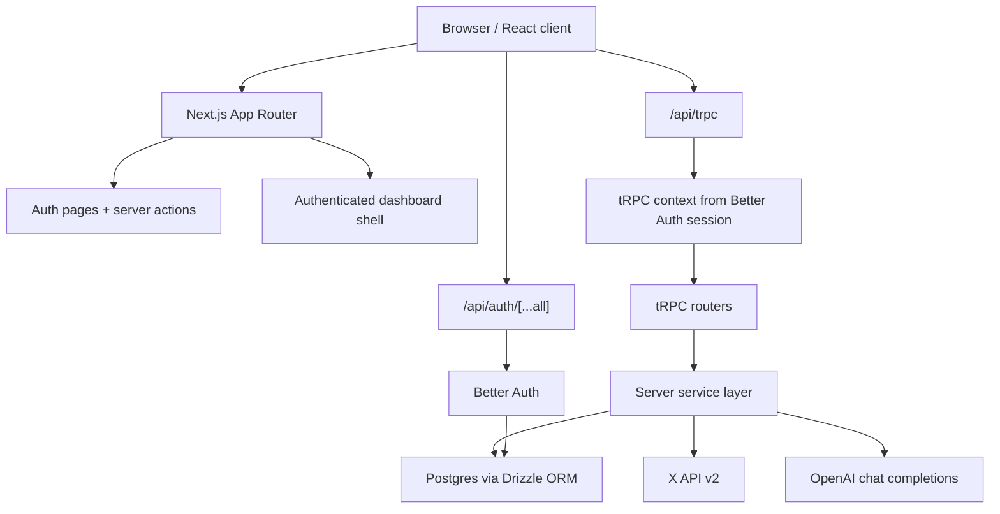

# Current Architecture

## Overview

`skaleai` is a Next.js 16 App Router application for discovering, organizing, and prioritizing X/Twitter leads for outreach.

The repository currently contains:

- A working authentication system.
- A working backend domain model for projects, leads, stats, outreach queueing, and API keys.
- A tRPC API layer that exposes those backend capabilities to the app.
- Integrations with the X API and OpenAI.
- A reusable UI/component system and authenticated dashboard shell.
- Placeholder feature pages for Search, Leads, Outreach, and Settings, which means the backend is materially ahead of the frontend.

In practical terms, the project is architected as a single Next.js app with server-side business logic, Postgres persistence, and a thin client layer.

## High-Level System Shape

## Application Layers

### 1. Next.js application layer

The app uses:

- `next@16.1.6`
- React `19.2.3`
- App Router under `src/app`
- Server Components by default
- Client Components where browser state or interaction is needed

Route groups are split into:

- `src/app/(auth)`: sign-in and sign-up flows
- `src/app/(main)`: authenticated dashboard area
- `src/app/api`: HTTP entry points for auth and tRPC

The root entry points are:

- `src/app/layout.tsx`: global HTML shell, Geist fonts, toast provider
- `src/app/page.tsx`: landing page that redirects signed-in users to `/leads`
- `src/app/(auth)/layout.tsx`: redirects authenticated users away from auth pages
- `src/app/(main)/layout.tsx`: protects the dashboard and mounts the sidebar plus tRPC provider

### 2. Authentication layer

Authentication is implemented with `better-auth`.

Core files:

- `src/lib/auth.ts`
- `src/lib/auth-client.ts`
- `src/app/api/auth/[...all]/route.ts`
- `src/app/(auth)/actions.ts`

How it works:

1. `betterAuth(...)` is configured in `src/lib/auth.ts`.
2. It uses the Drizzle adapter against the local Postgres schema.
3. Email/password auth is enabled.
4. Google OAuth is enabled as a social provider.
5. The `nextCookies()` plugin integrates auth cookies with Next.js.
6. The API handler is exposed through `toNextJsHandler(auth)` in `src/app/api/auth/[...all]/route.ts`.
7. Server-side session checks use `auth.api.getSession({ headers })`.
8. Client-side social login uses `createAuthClient(...)` from `src/lib/auth-client.ts`.

The auth flow is a mix of:

- Server Actions for email/password sign-in and sign-up
- Client-triggered Better Auth social login for Google
- Server-side session checks inside layouts and tRPC context creation

Current auth behavior:

- Auth pages redirect logged-in users to `/leads`.
- The main app layout redirects anonymous users to `/sign-in`.
- Email verification is not required.
- Google account linking is enabled and permissive.

### 3. API and RPC layer

The application uses `tRPC v11` as its typed API contract.

Core files:

- `src/server/trpc/trpc.ts`
- `src/server/trpc/context.ts`
- `src/server/trpc/root.ts`
- `src/server/trpc/routers/*.ts`
- `src/app/api/trpc/[trpc]/route.ts`
- `src/lib/trpc/client.tsx`
- `src/lib/trpc/react.tsx`
- `src/lib/trpc/server.ts`

How it works:

1. `src/app/api/trpc/[trpc]/route.ts` exposes a fetch-based tRPC endpoint at `/api/trpc`.
2. Each request builds context via `createContext`, which reads the Better Auth session from request headers.
3. `protectedProcedure` rejects unauthenticated access by requiring `ctx.userId`.
4. Routers delegate to a service layer instead of placing most business logic inline.
5. On the client, `TRPCProvider` creates:
   - a TanStack Query `QueryClient`
   - a tRPC client using `httpBatchLink`
   - `superjson` serialization
6. Server-side callers can use `serverTrpc()` to invoke the app router directly without HTTP.

Registered routers:

- `projects`
- `leads`
- `search`
- `stats`
- `outreach`
- `settings`

### 4. Service layer

Most business logic lives in `src/server/services`. This is the main backend boundary between transport and persistence/integrations.

Implemented services:

- `projects.ts`
- `leads.ts`
- `search.ts`
- `stats.ts`
- `outreach.ts`
- `api-keys.ts`

This is a good separation point in the current architecture:

- tRPC routers handle input validation and auth gating
- services implement workflows
- Drizzle handles persistence
- integration helpers live in `src/lib`

## Domain Model

The database schema lives in `src/db/schema.ts` and is managed through Drizzle migrations.

### Auth tables

Better Auth persists to:

- `user`
- `session`
- `account`
- `verification`

These are standard identity/session tables plus provider linkage.

### Application tables

#### `projects`

Represents a saved lead discovery context for a user.

Fields include:

- `id`
- `userId`
- `name`
- `query`
- `seedUsername`
- `createdAt`

Purpose:

- groups leads
- remembers what search or network import created the project

#### `leads`

This is the core CRM table.

Each lead belongs to a user and stores:

- X identity: `xUserId`, `handle`, `profileUrl`, avatar, bio
- audience metrics: followers/following
- CRM fields: `stage`, `priority`, `dmComfort`, `theAsk`, `inOutreach`
- enrichment placeholders: `email`, `budget`
- provenance: `discoverySource`, `discoveryQuery`
- timestamps

Important constraint:

- `(userId, handle, platform)` is unique, so the same X account is deduplicated per user

#### `project_leads`

Join table between projects and leads.

This allows:

- a many-to-many relationship
- adding an existing lead to a project without duplicating records

#### `post_stats`

Stores derived engagement metrics for a lead.

Fields include:

- `postCount`
- `avgViews`
- `avgLikes`
- `avgReplies`
- `avgReposts`
- `topTopics`
- `fetchedAt`

There is one row per lead due to a unique constraint on `leadId`.

#### `api_keys`

Stores user-generated API keys for future platform or external access.

Only the hash is stored permanently:

- raw keys are generated once
- `sha256` hash is persisted
- `prefix` is stored for display/identification

## Data Access Layer

Database access uses:

- `drizzle-orm`
- `postgres` (`postgres-js`)
- Drizzle schema-first definitions
- Drizzle Kit migrations

Core files:

- `src/db/index.ts`
- `src/db/schema.ts`
- `drizzle.config.ts`
- `drizzle.config.production.ts`
- `src/db/migrations/*`

How it works:

1. `src/db/index.ts` reads `DATABASE_URL`.
2. A shared `postgres(...)` client is created.
3. In development, the client is cached on `globalThis` to avoid extra connections during HMR.
4. Drizzle wraps the client and exports `db`.
5. Services import `db` and query against typed schema objects.

Migration strategy:

- local Drizzle config reads `.env.local`
- production Drizzle config reads `.env.production`
- migrations are committed under `src/db/migrations`

## External Integrations

### X API integration

The X integration lives in `src/lib/x-api.ts`.

It wraps X API v2 endpoints and provides:

- user search
- username lookup
- ID lookup
- followers pagination
- following pagination
- recent tweet search
- full-archive tweet search
- user tweet fetch
- tweet metric mapping

Important architectural details:

- all requests go through `xRequest(...)`
- Bearer auth is required through `X_API_BEARER_TOKEN`
- basic retry behavior exists for `429` and `5xx`
- retry delay is derived from `retry-after` or `x-rate-limit-reset`
- requests use `cache: "no-store"`

The app is X-only right now even though some types still call the platform `"twitter"`.

### OpenAI integration

The OpenAI integration lives in `src/lib/openai.ts`.

It is used for two things:

1. Ranking candidate X profiles for relevance to a search query
2. Extracting post topics and assigning a conservative lead priority (`P0` or `P1`)

Architectural behavior:

- Uses the `openai` SDK
- Defaults to model `gpt-4o` unless `OPENAI_MODEL` is set
- Uses structured JSON-schema responses
- Falls back safely if no API key is present or if the request fails

This means search/stat workflows still function without OpenAI, but with simpler fallback behavior.

### Better Auth + Google OAuth

Google OAuth is configured inside Better Auth and is part of the auth subsystem rather than a separate custom integration.

## Business Workflows

### 1. Sign-up and sign-in

Files involved:

- `src/app/(auth)/actions.ts`
- `src/components/auth/login-form.tsx`
- `src/components/auth/signup-form.tsx`
- `src/lib/validations/auth.ts`

Flow:

1. User submits form.
2. A Server Action validates the `FormData` with Zod.
3. The action calls Better Auth email APIs.
4. On success, the user is redirected to the internal callback path.
5. Social sign-in uses the Better Auth client directly from the browser.

### 2. Request authentication for app APIs

Flow:

1. Browser calls `/api/trpc`.
2. tRPC creates request context.
3. Context reads the Better Auth session from headers.
4. Protected procedures require `userId`.
5. Services run using the authenticated user ID for row scoping.

The architecture consistently scopes data by `userId` in queries and mutations.

### 3. Search and add leads

Files involved:

- `src/server/trpc/routers/search.ts`
- `src/server/services/search.ts`
- `src/lib/x-api.ts`
- `src/lib/openai.ts`
- `src/server/services/leads.ts`
- `src/server/services/projects.ts`

Flow:

1. A caller invokes `search.run`.
2. The service resolves a project:
   - use an existing project if `projectId` is supplied
   - otherwise create a new project
3. Candidate profiles are collected from multiple X sources:
   - profile search
   - recent post search
   - reply search if a seed username is provided
   - follower network crawl if a seed username is provided
   - optional full-archive post search when enabled
4. Candidates are deduplicated by X user ID.
5. OpenAI ranks relevance when available.
6. Top candidates are upserted into `leads`.
7. The leads are linked to the project through `project_leads`.

Notable constants:

- `SEARCH_TARGET = 40`
- `NETWORK_TARGET = 1000`

### 4. Import a full account network

Flow:

1. A caller invokes `search.importNetwork`.
2. The seed X account is resolved by username.
3. A project is found or created.
4. Followers and following are paged in parallel.
5. Profiles are deduplicated.
6. Profiles are added to the project as leads.

This workflow is heavier than query-based search and is built around network expansion rather than keyword relevance.

### 5. Refresh profile stats and AI priority

Files involved:

- `src/server/services/search.ts`
- `src/server/services/stats.ts`
- `src/lib/x-api.ts`
- `src/lib/openai.ts`

Flow:

1. A caller invokes `stats.refresh`.
2. The service loads the lead.
3. It fetches recent user tweets from X.
4. Raw tweet metrics are transformed into averages.
5. OpenAI extracts topics and recommends `P0` or `P1`.
6. `post_stats` is upserted.
7. If `crmId` was provided, the lead priority is updated in `leads`.

### 6. Lead management

Files involved:

- `src/server/trpc/routers/leads.ts`
- `src/server/services/leads.ts`

Supported operations:

- paginated lead listing
- full-text-ish search over name/handle using `ILIKE`
- project filter
- outreach filter
- stage filter
- lead patch/update
- delete

Lead updates currently allow:

- stage
- priority
- DM comfort
- ask text
- outreach flag
- email
- budget

### 7. Outreach queueing

Outreach is currently simple:

- `projects.queueAllLeads` bulk-sets `inOutreach = true` for all leads in a project
- `outreach.list` returns all leads with `inOutreach = true`

There is no campaign orchestration, scheduling, or message delivery system yet.

### 8. API key management

Files involved:

- `src/server/services/api-keys.ts`
- `src/server/trpc/routers/settings.ts`

Flow:

1. User requests a new API key.
2. A random key of the form `sk_<hex>` is generated.
3. The key is hashed with SHA-256.
4. Only the hash and a display prefix are stored.
5. The raw key is returned once to the caller.

## Frontend Architecture

### Shell and navigation

The main dashboard shell is already present:

- desktop sidebar
- mobile drawer header
- nav entries for Search, Leads, Outreach, Settings
- sign-out form in the sidebar

Projects navigation is partially planned:

- `ProjectsList` exists in the sidebar
- it currently contains a `TODO` and does not fetch data via tRPC yet

### Feature pages

Current main pages are placeholders:

- `src/app/(main)/search/page.tsx`
- `src/app/(main)/leads/page.tsx`
- `src/app/(main)/outreach/page.tsx`
- `src/app/(main)/settings/page.tsx`

They currently render `"coming soon"` text.

This is the most important current-state architecture fact: the backend domain and API are ahead of the actual feature UI.

### UI system

The UI stack uses:

- Tailwind CSS 4
- `shadcn` registry/config
- `@base-ui/react` primitives
- `lucide-react` icons
- local wrappers in `src/components/ui`
- custom toast system

Notes:

- `components.json` is configured with the `new-york` shadcn style.
- CSS variables are defined in `src/app/globals.css`.
- Fonts are loaded with `next/font/google` using Geist Sans and Geist Mono.

There is a sizable local component library under `src/components/ui`, which suggests the intended UI direction is a reusable design-system layer rather than ad hoc page markup.

## Validation and Type Strategy

The project uses:

- TypeScript in `strict` mode
- Zod for runtime input validation
- tRPC inference for end-to-end API types
- shared domain types in `src/lib/types.ts`

Type safety works across several boundaries:

- form input validation
- tRPC procedure inputs
- tRPC router inference on the client
- typed database schema and query results

Serialization between client and server uses `superjson`.

## Environment and Configuration

Confirmed environment dependencies:

- `DATABASE_URL`
- `BETTER_AUTH_URL`
- `NEXT_PUBLIC_APP_URL`
- `GOOGLE_CLIENT_ID`
- `GOOGLE_CLIENT_SECRET`
- `OPENAI_API_KEY`
- `OPENAI_MODEL` optional
- `X_API_BEARER_TOKEN`
- `X_ENABLE_FULL_ARCHIVE` optional

Behavior controlled by config:

- `next.config.ts` marks `apify-client` as a server external package
- `tsconfig.json` sets the `@/*` path alias and strict compiler behavior
- `eslint.config.mjs` uses Next core-web-vitals and TypeScript rules
- `postcss.config.mjs` uses `@tailwindcss/postcss`

## Build, Runtime, and Tooling

Scripts and tooling indicate the intended development workflow:

- `bun` lockfile is present and test scripts use `bun test`
- a `package-lock.json` is also present, so the repo has mixed package-manager artifacts
- `next dev --turbopack` is the development server
- `next build` and `next start` are standard production commands
- Drizzle Kit manages database schema changes

Available scripts:

- `dev`
- `build`
- `start`
- `lint`
- `test`
- `test:unit`
- `test:integration`
- `test:coverage`
- `db:generate`
- `db:migrate`
- `db:push`
- `db:studio`
- production Drizzle variants

Current-state caveat:

- there is no `tests/` directory in this repository right now even though the test scripts exist

## Current Gaps, Stubs, and Inconsistencies

This section matters because it describes the real architecture, not the intended one.

### Implemented backend, incomplete frontend

The most visible gap is that the domain backend exists, but the main user-facing feature pages are still placeholders.

### Stubbed enrichment features

In `src/server/services/leads.ts`:

- `enrichLeadEmails(...)` returns `0`
- `scanProjectEmails(...)` returns `0`

So email enrichment is modeled in the schema and API, but not implemented.

### Stale or partially wired UI component

`src/components/leads/LeadDetailSheet.tsx` appears to be from an earlier or parallel UI path.

It currently references:

- `/api/post-stats`
- `/api/followers`

Those route handlers do not exist in this repository. The current backend exposes equivalent capabilities through tRPC instead.

That means this component is presently not aligned with the live API architecture.

### Project sidebar is not connected

`ProjectsList` in the sidebar keeps local state and contains a `TODO` to replace it with a tRPC query.

### App naming mismatch

There is some naming drift:

- package name is `"mark"`
- app metadata title is `"skaleai"`
- the repository/workspace is `skaledotai`

This is not a runtime bug by itself, but it is part of the current architecture reality.

### Unused or not-yet-used dependencies

Dependencies declared but not currently used in the repo code include:

- `apify-client`
- `@tanstack/react-query-devtools`
- `radix-ui`

`apify-client` is also called out in `next.config.ts` as an external package, which suggests a planned server integration that is not implemented yet.

## Architectural Strengths

The current structure already has several sound choices:

- auth, transport, services, and persistence are separated cleanly
- user scoping is consistently enforced in backend queries
- external integrations are wrapped behind local library modules
- database schema and application types mostly line up well
- AI usage is optional and has fallback behavior
- the app is positioned to add frontend features without major backend rewrites

## Architecture Summary

Today, the system is best understood as:

- a monolithic Next.js application
- using Better Auth for identity
- using tRPC for typed internal APIs
- using Drizzle + Postgres for persistence
- using X API for lead discovery and post metrics
- using OpenAI for ranking and classification
- using Tailwind/Base UI/shadcn-style components for the frontend

The product is currently backend-first:

- core workflows and data structures are implemented
- the authenticated shell exists
- the feature UI is still being built on top of that foundation
