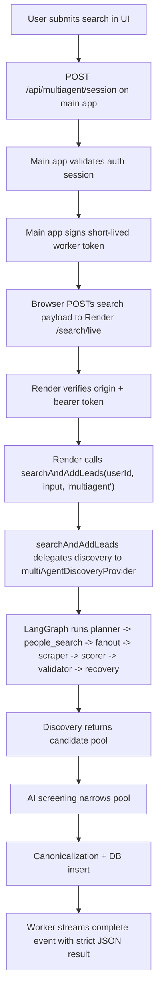

# Multi-Agent System

This document describes the current `multiagent` lead-search system end to end: how the browser starts a run, how the dedicated Render worker authenticates and streams it, how the LangGraph discovery graph works internally, and how the final leads are screened and persisted.

The implementation is split across:

- `src/components/search/SearchForm.tsx`
- `src/app/api/multiagent/session/route.ts`
- `src/lib/multiagent-service-auth.ts`
- `services/multiagent-service/server.ts`
- `src/server/services/search.ts`
- `src/lib/x/multiagent.ts`
- `src/lib/x/multiagent-types.ts`
- `src/lib/x/multiagent-trace.ts`
- `src/lib/x/multiagent-shared.ts`
- `src/lib/x/tavily.ts`
- `src/lib/x/agentql.ts`
- `src/lib/x/twitterapi.ts`
- `src/lib/x/niche-examples.ts`
- `src/lib/openai.ts`
- `src/lib/validations/multiagent-service.ts`

## 1. High-Level Goal

The system is built to find **targeted promotion leads** on X — people who would potentially interact with, repost, or promote content about a specific niche in exchange for payment. Example queries:

- `"product designers working in startups"`
- `"fintech founders"`
- `"AI engineers building in public"`

The system's core principle is **relevance over reach**: a 2k-follower creator who actively discusses the niche and shows engagement behavior is far more valuable than a 200k-follower account that never engages with the topic. Follower count is only a pre-filter (minimum threshold), never a scoring signal or evidence.

It does not rely on one search call. Instead, it runs a bounded supervisor-style workflow that:

1. Interprets the search goal to understand the essence of the ideal lead — who they are, what their bio says, how they engage.
2. Plans discovery queries targeting engaged niche participants (bio identity + engagement behavior).
3. Scrapes X People Search pages directly for each role term (primary discovery source).
4. Fans queries out to Tavily with advanced search depth for supplementary profile URLs.
5. Scrapes discovered X profile URLs with AgentQL (profile + tweets).
6. Hydrates candidate profiles with canonical data via TwitterAPI.io or X API.
7. Scores candidates purely by niche relevance: topic overlap, bio alignment, post evidence, creator signals, engagement willingness. Follower count = 0 score contribution.
8. Pre-screens candidates using a lightweight AI model to reject obvious non-matches (wrong role, organizations, bots) before they enter the pool.
9. Extracts concrete evidence: exact bio quotes, post excerpts with engagement stats, handle identity signals, and website content.
10. Validates whether the graph has enough candidate coverage.
11. Either terminates or enters a recovery lane and retries with adjusted parameters.

The graph is implemented with `@langchain/langgraph`. The model wrapper used by the planner is `@langchain/openai`, but orchestration, branching, fanout, recovery, and termination are owned by LangGraph.

## 2. Architectural Split

The multi-agent system is intentionally split into two runtime layers:

- Main web app on Vercel
- Dedicated `multiagent` worker service on Render

The reason for the split is operational, not logical. The browser-facing lead-search flow is the same, but long-lived streaming discovery now runs outside the Vercel request-duration envelope.

### What stayed the same

- The core lead-search function is still `searchAndAddLeads(...)`.
- The strict NDJSON event contract is preserved.
- The frontend still receives step-by-step reasoning and graph snapshots.
- Final results are still inserted into the same project and database tables.

### What changed

- The browser no longer depends on a single long-running Vercel route for `multiagent`.
- The browser requests a signed worker session from the main app.
- The browser then opens the live NDJSON stream directly to the Render worker.

## 3. End-to-End Request Lifecycle



## 4. Frontend Flow

The user starts from `SearchForm`.

### Step 1: Get stream target

`SearchForm.tsx` calls:

- `POST /api/multiagent/session`

That route decides whether the run should use:

- local mode: stream back to the app
- external mode: stream directly to the dedicated worker

In the current deployed architecture, `multiagent` uses external mode whenever `MULTIAGENT_SERVICE_URL` is configured.

### Step 2: Open live stream

The browser then sends the original search payload to the worker:

- `query`
- `projectId` or `projectName`
- optional `followerUsername`
- `minFollowers`
- `targetLeadCount`

The frontend parses newline-delimited JSON events and updates three pieces of UI state:

- `streamSteps`: human-readable reasoning steps
- `streamSnapshot`: graph progress snapshot
- `streamTrace`: final run trace after completion

### Event types

The stream uses a strict schema and emits four event types:

- `step`
- `snapshot`
- `complete`
- `error`

`step` events are descriptive reasoning entries.
`snapshot` events update the live graph state.
`complete` carries the final persisted search result.
`error` carries a normalized failure message.

If the stream closes without `complete` or `error`, the frontend treats that as a transport failure.

## 5. Session Handoff and Worker Authentication

The route `src/app/api/multiagent/session/route.ts` is responsible for minting a short-lived worker token.

### Session route responsibilities

1. Validate the signed-in web session using `getRequestSession()` from the app auth layer.
2. Read `MULTIAGENT_SERVICE_URL` via `getMultiAgentServiceUrl()`.
3. If the external worker is **not** configured, return `mode: "local"` with `streamUrl: "/api/search/live"`.
4. If the external worker is configured, call `createMultiAgentServiceToken(...)` to sign a token that includes:
   - `sub`: user id
   - `iss`: `skaledotai-web`
   - `aud`: `skaledotai-multiagent-service`
   - `provider`: `multiagent`
   - `exp`: expiry timestamp (default: 30 minutes from now)
   - `origin`: optional frontend origin
5. Return:
   - `mode: "external"`
   - external stream URL (`${serviceUrl}/search/live`)
   - bearer token
   - expiration timestamp as ISO string

The token is HMAC-signed (HS256) with `MULTIAGENT_SERVICE_SHARED_SECRET` using Node's `crypto.createHmac`. The token is structured as three base64url-encoded parts: `header.payload.signature`.

### Token creation (`createMultiAgentServiceToken`)

Located in `src/lib/multiagent-service-auth.ts`:

1. Reads the shared secret from `MULTIAGENT_SERVICE_SHARED_SECRET` (throws if missing).
2. Constructs a payload object validated against `MULTIAGENT_SERVICE_TOKEN_SCHEMA` (Zod strict schema).
3. Base64url-encodes both the header (`{"alg":"HS256","typ":"JWT"}`) and the payload.
4. Signs the unsigned token (`header.payload`) with HMAC-SHA256.
5. Returns the full token string and parsed payload.

### Token verification (`verifyMultiAgentServiceToken`)

1. Splits the token into three parts; rejects if not exactly three.
2. Recomputes the HMAC signature and compares using `timingSafeEqual` (constant-time comparison to prevent timing attacks).
3. Parses and validates the payload against the Zod schema.
4. Checks the `exp` field against current time; rejects expired tokens.

### Worker-side checks

`services/multiagent-service/server.ts` verifies:

- the request origin is allowed by `MULTIAGENT_ALLOWED_ORIGINS` (via `isAllowedMultiAgentOrigin`)
- the bearer token exists (extracted from `Authorization: Bearer <token>`)
- the token signature is valid
- the token has not expired
- the token origin matches the request origin when origin is embedded

### Origin validation (`isAllowedMultiAgentOrigin`)

Parses `MULTIAGENT_ALLOWED_ORIGINS` as a comma-separated list of exact origins. Returns `true` if:
- No origin is provided in the request
- The allowed origins list is empty
- The list contains `*`
- The origin is in the allowed list

This design keeps the worker stateless. The worker does not need the web app's auth cookies; it only needs a short-lived signed assertion from the main app.

## 6. Render Worker Responsibilities

The Render worker (`services/multiagent-service/server.ts`) is a raw Node `http.createServer` instance exposing a small HTTP surface:

- `POST /search/live` — the main streaming endpoint
- `GET /healthz` — health check returning `{ ok: true, service: "multiagent" }`
- `OPTIONS *` — CORS preflight handling

The worker is a thin transport layer. It does not reimplement the search logic. Its responsibilities are:

1. **Handle CORS**: Build CORS headers via `buildCorsHeaders()` for every response. Sets `access-control-allow-origin`, `access-control-allow-methods`, `access-control-allow-headers`, and `access-control-max-age: 86400`. The `Vary: Origin` header ensures caches respect per-origin responses.
2. **Verify worker auth**: Extract bearer token, verify signature and expiry, validate origin.
3. **Parse the search payload**: Read the JSON body via `readJsonBody()` (streaming buffer concatenation), validate with `SearchLeadInputSchema`.
4. **Call the shared search pipeline**:
   ```
   searchAndAddLeads(userId, input, "multiagent", progressHandlers)
   ```
5. **Stream progress events as NDJSON**: Each event is validated through `SearchRunStreamEventSchema.parse()` and written as `JSON.stringify(payload) + "\n"`. Response headers include `content-type: application/x-ndjson`, `cache-control: no-cache, no-transform`, and `x-accel-buffering: no` (prevents Nginx/reverse-proxy buffering).
6. **Handle cancellation**: Listens for `req.on("close")` to detect client disconnect. All subsequent writes are guarded by `safeWriteEvent()` which checks `cancelled`, `res.destroyed`, and `res.writableEnded`.
7. **Emit a final event**: Either `complete` (with full search result including leads, project, and trace) or `error` (with normalized message). Errors from `searchAndAddLeads` are caught and converted via `toXProviderTrpcError`.
8. **Log compact reasoning/milestone events**: Three log families for Render observability.

The worker is intentionally thin so that the search logic remains centralized and behavior stays aligned with the original in-app implementation.

## 7. Core Search Orchestration

The main orchestration entrypoint is:

- `searchAndAddLeads(...)` in `src/server/services/search.ts`

This function owns the full lead-search pipeline:

1. Resolve or create the destination project.
2. Run discovery.
3. Build a screening pool.
4. Run AI screening.
5. Canonicalize profile rows.
6. Insert leads into the project.
7. Record the project run.
8. Build the final trace returned to the UI.

### Discovery ownership

Discovery is the only part that behaves differently by provider.

For most providers, the service layer owns the retry loop.
For `multiagent`, the provider owns its own loop internally through LangGraph.

That distinction is important:

- non-`multiagent` providers: service-level bounded retry
- `multiagent`: provider-level graph with its own retries, recovery, and termination

### Candidate goal vs target lead count

The user may ask for `~40` final leads. The system deliberately over-fetches discovery candidates before screening.

It computes:

- `targetLeadCount`: desired final lead count (soft target, not a hard cap)
- `goalCount`: desired discovery candidate count
- `parseAccountsTarget`: candidate parsing budget
- `minFollowers`: minimum follower threshold (multiples of 1000) — used only as a pre-filter, never as a scoring signal or evidence

This separation exists because discovery must usually gather more raw candidates than the final lead target in order to survive filtering and screening. The target is approximate — if more relevant leads pass evidence-based screening, they are all kept.

## 8. Discovery Provider: LangGraph-Owned Loop

The `multiagent` discovery provider lives in `src/lib/x/multiagent.ts`.

Its exported provider is:

- `multiAgentDiscoveryProvider`

Its exported generic client wrapper is:

- `multiAgentClient`

The discovery provider compiles and executes a LangGraph state machine whose state includes:

- request metadata (`niche`, `seedHandle`, `limit`, `minFollowers`, `targetLeadCount`, `goalCount`)
- current attempt and limits (`attempt`, `maxAttempts`)
- query budget (`queryBudget`)
- scrape batch size (`scrapeBatchSize`)
- planner-interpreted search context (`normalizedQuery`, `queryType`, `roleTerms`, `bioTerms`, `geoHints`, `antiGoals`, `userGoals`)
- current and planned queries (`currentQueries`, `plannedQueries`)
- discovered URLs (`candidateUrls`)
- processed URLs (`processedUrls`)
- repair URLs (`repairUrls`)
- scraped payloads (`scraped`)
- scored candidates (`scored`)
- final candidate set (`candidates`)
- accumulated error records (`errors`)
- recovery state (`recoveryState`, `plannerMode`)
- stop reason (`stopReason`)
- trace-only fields for UI logging (`activeNode`, `activeSubagent`, `completedNodes`, `traceQuery`, `traceBatchUrls`, `recoveryNote`, `firstPassCount`, `lastAttemptYield`, `lastAttemptRawCount`, `plannerFallbackUsed`, `hydratedCount`, `hydrationTools`)

The graph streams both:

- `updates`
- `values`

Those are converted into:

- trace steps for the reasoning panel (via `buildMultiAgentTraceStep`)
- live snapshots for the graph/metrics panel (via `toMultiAgentStreamSnapshot`)

The recursion limit is set to `Math.max(28, maxAttempts * 8)` to allow enough graph cycles for recovery.

## 9. State Model

The LangGraph state tracks both business state and observability state. It uses `Annotation.Root` from `@langchain/langgraph` with custom reducers for safe parallel state merging.

### State fields with custom reducers

| Field | Reducer behavior |
|-------|-----------------|
| `plannedQueries`, `candidateUrls`, `processedUrls`, `completedNodes`, `userGoals`, `roleTerms`, `bioTerms`, `geoHints`, `antiGoals`, `hydrationTools` | `mergeUniqueStrings` — appends new values, deduplicates by lowercase |
| `scraped` | `mergeScrapedPayloads` — deduplicates by URL, last write wins |
| `scored` | `mergeScoredCandidates` — deduplicates by handle, keeps highest score (tiebreak by evidence count) |
| `candidates` | `mergeCandidates` — deduplicates by handle, keeps version with most posts (then bio length) |
| `errors` | append-only `[...left, ...right]` |
| `currentQueries`, `repairUrls`, `plannerMode`, `recoveryState`, `stopReason`, `activeNode`, `activeSubagent`, `traceBatchUrls`, `traceQuery`, `recoveryNote`, `plannerFallbackUsed`, `firstPassCount`, `lastAttemptYield`, `lastAttemptRawCount`, `hydratedCount` | last-write-wins `(_left, right) => right` |
| `normalizedQuery`, `queryType` | last-write-wins, with fallback to previous if new value is empty |

Reducers are critical because the graph uses `Send` fanout, so multiple branches can update shared state in the same run.

### Budget resolution functions

| Function | Purpose |
|----------|---------|
| `resolveMultiAgentQueryBudget` | Scales query count with target: ≥220 leads → 10, ≥120 → 8, ≥60 → 6, else 4 |
| `resolveMultiAgentUrlLimit` | Scales URL budget: `max(20, min(160, ceil(requested * 0.4)))` |
| `resolveMultiAgentScrapeBatchSize` | Derived from URL budget: `max(4, min(16, ceil(urlBudget / 6)))` |

## 10. Node-by-Node Graph Behavior

The current graph has 8 nodes:

1. `planner` (subgraph: `goal_interpreter` → `dork_planner`)
2. `people_search`
3. `source_fanout` (subgraph: `source_researcher`)
4. `scrape_router`
5. `scraper`
6. `scorer` (subgraph: `profile_hydrator` → `candidate_scorer`)
7. `validator`
8. `recovery`

### 10.1 Planner (Subgraph)

The planner is a compiled LangGraph **subgraph** (`plannerSubgraph`) with two sequential nodes:

#### 10.1.1 Goal Interpreter subagent

**Tool used: OpenAI** (via `ChatOpenAI` with structured output `GoalInterpretationSchema`)

The goal interpreter analyzes the search query to understand the **essence of the ideal lead**. It receives the raw user query and optional seed handle and produces a structured interpretation:

- **normalizedQuery**: Cleaned search phrase stripped of filler words ("I want to find", "looking for", "best", "top", "on X/Twitter"). Uses `heuristicNormalizeQuery()` as fallback.
- **queryType**: `"role"` (job/profession), `"product"` (tool users/builders), or `"niche"` (industry/space). Default: `"role"`.
- **roleTerms**: Who these people are. Includes singular form first (how bios are written on X), plural, discipline/field form (e.g., "product design"), X-specific abbreviations, seniority prefixes, and adjacent synonyms.
- **bioTerms**: Realistic X bio phrases — how people actually write on X, not formal titles. Patterns like `[Role] at @[Company]`, `[Role] | [Side project]`, `I [verb] [thing]`.
- **geoHints**: Optional location signals extracted from the query.
- **antiGoals**: Specific adjacent roles/account types to avoid — not generic terms like "irrelevant" but exact confusable roles (e.g., for "motion designers": "motion graphics company", "video editor").
- **userGoals**: Short descriptions capturing the essence of the ideal lead.

The prompt includes up to 3 relevant reference examples selected from `src/lib/x/niche-examples.ts` via `selectRelevantExamples()`, which matches examples by keyword overlap with the user's query.

**Role variant generation** (`buildRoleVariants`): For each role phrase, generates singular/plural variants plus discipline mappings (e.g., "designer" → "design", "engineer" → "engineering", "founder" → "founding") using a hardcoded mapping table of 20+ suffix pairs.

**Heuristic fallback** (`buildHeuristicGoalInterpretation`): If the AI interpretation fails, times out, or returns unusable output, the system falls back to deterministic interpretation using regex-based query normalization, `buildRoleVariants()`, geo extraction, and hardcoded anti-goals.

#### 10.1.2 Dork Planner subagent

**Tools used: OpenAI** (structured output via `QueryPlanSchema`), **heuristic query builders**

Generates Google dork queries and heuristic queries using the goal interpretation. The function `buildPlannerQueries()` has five modes:

##### Planner modes

| Mode | Trigger | Behavior |
|------|---------|----------|
| `initial` | First attempt, no recovery state | Generates dork queries from roleTerms + bioTerms + geo + twitter.com variant, combined with heuristic queries and attempt variants |
| `expansion` | Recovery state = `low_yield` | Calls `expandLeadSearchQueries()` from `src/lib/openai.ts` to get AI-generated query expansions, then merges with dork/heuristic/variant queries. Budget increased by +1 |
| `repair` | Recovery state = `json_repair` | Relies on deterministic dork + variant + heuristic queries only (no AI planner call). Sets `usedFallback: true` |
| `throttle` | Recovery state = `rate_limited` | Uses dork + heuristic + variant queries with reduced budget (budget - 1, minimum 2) |
| `precision` | Recovery state = `precision_filtered` | Generates highly targeted queries using exact roleTerms + bioTerms. Budget increased by +2. Uses `site:x.com` and `site:twitter.com` with quoted role phrases |

##### Google dork query patterns

When no seed handle is provided:
- Individual roleTerms as separate `site:x.com "term"` queries (up to 4)
- Individual bioTerms as `site:x.com "term"` queries (up to 3)
- Geo-targeted variant: `site:x.com "primaryTerm" "geoHint"`
- Legacy variant: `site:twitter.com "primaryTerm"`

When searching within a user's followers (seed handle provided):
- All queries scope to `site:x.com/{handle}/verified_followers`
- Variants include primary term, roleBlock, bioBlock, and geo combinations

All queries are deduplicated (case-insensitive) and capped at `queryBudget`. Previously planned queries are excluded via `withNewQueries()`.

##### Heuristic queries (`buildMultiAgentHeuristicQueries`)

Fallback query generation that doesn't depend on AI:
- Uses `buildRoleVariants()` on the normalized query
- Generates `site:x.com "variant"` for up to 3 variants
- Adds `site:twitter.com "variant[0]"` for older indexed profiles
- Respects seed handle scoping to verified_followers

#### Planner model

**Tool: OpenAI** via `ChatOpenAI` from `@langchain/openai` with:

- model: `MULTIAGENT_PLANNER_MODEL` or `OPENAI_MODEL` or `gpt-5`
- reasoning effort: `medium`

Structured output is enforced with Zod schemas (`GoalInterpretationSchema`, `QueryPlanSchema`).

#### Planner timeout

The planner is wrapped in a hard timeout via `withTimeout()` (Promise.race with setTimeout) controlled by:

- `MULTIAGENT_PLANNER_TIMEOUT_MS`
- Default: `45000ms`
- Minimum: `5000ms`
- Maximum: `120000ms`

If the timeout fires, the error is named `AbortError` to match abort semantics.

### 10.2 People Search

**Tool used: AgentQL** (via `scrapeXPeopleSearch()`)

This is the **PRIMARY discovery source**. After the planner produces roleTerms and bioTerms, this node scrapes X's native People Search page (`x.com/search?q=...&f=user`) for each term.

Responsibilities:

1. Collect up to 8 roleTerms + 3 bioTerms, deduplicated.
2. If no terms available, fall back to `normalizedQuery`.
3. Skip terms whose People Search URLs were already scraped in a previous pass (checks `processedUrls`).
4. Run **two rounds** per term:
   - Round 1: `min_faves:50` filter — finds active, higher quality accounts
   - Round 2: No filter — catches smaller/newer accounts that are still relevant
5. Execute with concurrency of 3 via `mapWithConcurrency()`.
6. Each successful scrape produces a `ScrapedPayload` with URL `https://x.com/search?q={encodedTerm}&f=user`.
7. All scraped URLs are recorded in `processedUrls` to prevent re-scraping.

Each People Search page yields 10-20 highly relevant profiles per term, giving broad coverage across follower ranges.

### 10.3 Source Fanout

**Tool used: Tavily** (via `searchTavily()` or `searchTavilyWithExclusions()`)

`source_fanout` runs one branch per query using LangGraph's `Send` fanout. It is wrapped in a compiled subgraph (`sourceResearchSubgraph`) with a single `source_researcher` node.

This node uses Tavily search with `search_depth: "advanced"` to discover **supplementary** candidate X profile URLs related to each planned query. It complements People Search by finding profiles indexed by Google that may not appear in X's native search.

Responsibilities:

- Execute Tavily search. If `excludeTerms` are provided (antiGoals from the planner, up to 5), calls `searchTavilyWithExclusions()` instead.
- Normalize discovered URLs via `normalizeDiscoveredUrls()`.
- Enforce a bounded URL budget via `resolveMultiAgentUrlLimit()`.
- Attach query-scoped error records if Tavily fails (structured `MultiAgentErrorRecord`).
- When searching within a user's followers (seed handle provided), inject `https://x.com/{handle}/verified_followers` at the front of the URL list.

This node does not scrape profiles directly. It only produces candidate profile URLs.

### 10.4 Scrape Router

`scrape_router` is a graph-routing node, not a data-extraction node. It runs no tools.

Responsibilities:

- Prioritize `repairUrls` when recovery wants specific failed URLs retried.
- Combine them with newly discovered URLs via `mergeUniqueStrings`.
- Exclude already processed URLs.
- Enforce URL limits via `resolveMultiAgentUrlLimit()`.
- Batch URLs into scrape groups via `chunk()` using `scrapeBatchSize` (minimum 4).
- Emit one `Send("scraper", ...)` per batch, or route to `scorer` if no batches.

This is the map-reduce fanout stage for scraping.

### 10.5 Scraper

**Tool used: AgentQL** (via `queryAgentQl()`)

`scraper` runs one branch per URL batch using LangGraph's `Send` fanout.

It uses AgentQL to extract profile payloads from X URLs. Each URL is scraped with bounded concurrency of `MULTIAGENT_SCRAPE_CONCURRENCY` (2) via `mapWithConcurrency()`.

Responsibilities:

- Call `queryAgentQl(url, "discovery")` for each URL in the batch.
- Accumulate raw `ScrapedPayload` entries `{ url, payload }`.
- Record all URLs in `processedUrls` (even failed ones, via the `finally` block).
- Attach per-URL error records when a scrape fails (only `XProviderRuntimeError` is caught; other errors propagate).

Failures do not kill the run. They become structured error records that the validator can use to route the graph into recovery.

### 10.6 Scorer (Subgraph)

The scorer is a compiled LangGraph **subgraph** (`hydrationScoringSubgraph`) with two sequential nodes:

#### 10.6.1 Profile Hydrator subagent

**Tools used: TwitterAPI.io** (primary), **X API** (fallback), **AgentQL** (already used for scraping)

Before scoring, candidates are enriched with canonical profile data from external APIs:

1. Collect unique `xUserId` values from all candidates.
2. **Primary**: Call `lookupTwitterApiUsersByIds()` from `src/lib/x/twitterapi.ts` — batch lookup via TwitterAPI.io.
3. **Fallback**: If TwitterAPI.io fails with `NOT_CONFIGURED`, `UPSTREAM_REQUEST_FAILED`, or `UPSTREAM_INVALID_RESPONSE`, try `lookupUsersByIds()` from `src/lib/x/api.ts` — the X API.
4. **If both fail**: Continue with un-hydrated candidates (graceful degradation).
5. Merge canonical data via `mergeCandidateWithProfile()`: prefers API data for handle, name, bio (if non-empty), location, followers (takes max), following (takes max), verification status, avatar URL, profile URL, and xUserId.

The `hydrationTools` field tracks which APIs were actually used (e.g., `["AgentQL", "TwitterAPI.io"]`).

#### 10.6.2 Candidate Scorer subagent

**Tool used: OpenAI** (for pre-screening), **AgentQL** (for website evidence scraping)

This node converts scraped profiles into scored candidates through a multi-phase pipeline:

##### Phase 1: Heuristic scoring + evidence extraction

Each candidate is scored deterministically via `scoreCandidateHeuristically()`:

**Keyword extraction** (`extractKeywords`): Builds a rich keyword set from the niche string:
- Full phrase + singular/plural/discipline variants (highest value)
- Bigrams + their plural variants
- Individual words + their plural variants
- Stop words filtered out (100+ common English words)

**Scoring formula** (0-100 clamped):

| Signal | Calculation | Max points |
|--------|-------------|-----------|
| Profile phrase matches | `phraseHits * 20` | 60 |
| Profile word matches | `wordHits * 3` | (contributes to 60 cap) |
| Post phrase matches | `postPhraseHits * 10` | 30 |
| **No phrase match penalty** | `-10` if no phrase match in profile or posts | — |
| **Follower count** | **Not a scoring signal** | **0** |

Profile text includes display name + bio + handle (display names like "Gaga | Product Designer" are strong signals).

**Evidence extraction** (`extractSelectionEvidence`):

| Source | What's checked | When included |
|--------|---------------|---------------|
| Bio | Niche phrase and word matches in bio text | At least one match found |
| Post | Niche keyword matches across up to 2 posts | Post contains any niche keyword |
| Handle | Niche keyword matches in handle | Any keyword found in handle |

Each evidence piece includes a `snippet` (the actual text) and `whyItAligns` (which keywords matched).

##### Phase 2: Website evidence scraping

**Tool used: AgentQL** (via `queryAgentQlBestEffort()`)

For candidates whose bio contains a URL or domain-like pattern (matched via `extractBioWebsiteUrl()`):
1. Extract the URL from bio text (supports `https://...` and bare domains like `word.com/io/dev/ai/etc`).
2. Scrape the website content via `queryAgentQlBestEffort()`.
3. Check the first 3000 characters for niche keyword matches.
4. If matches found, add a `"bio"` evidence piece with website content snippet and matched keywords.
5. Runs with concurrency of 2 via `mapWithConcurrency()`.

##### Phase 3: AI pre-screening

**Tool used: OpenAI** (via `ChatOpenAI` with structured output `PreScreenDecisionSchema`)

A lightweight AI filter that removes obvious non-matches BEFORE they enter the candidate pool:

1. Build candidate summaries: handle, name, bio (200 chars), top 2 posts (120 chars each).
2. Construct a prompt with the niche and context-specific rules from the planner's interpretation:
   - roleTerms define what makes a person relevant
   - bioTerms define expected bio signals
   - antiGoals explicitly name roles/types to reject
3. Call the planner model with `withTimeout("OpenAI planner", 30_000, ...)`.
4. Parse structured output: `{ decisions: [{ handle, relevant, confidence }] }`.
5. Build a set of passed handles where `relevant === true && confidence >= 40`.

Key rules in the prompt:
- A keyword in a different context is NOT a match
- Organizations, communities, newsletters, job boards = always irrelevant
- Adjacent senior roles (VP, Head of, Director) are NOT the same as hands-on roles

**Graceful failure**: If pre-screening times out or fails, ALL candidates pass through. The final AI screening in the pipeline will catch non-matches.

##### Result

Only candidates that passed pre-screening are returned as `ScoredCandidate` entries with score, reasons, attempt number, and evidence array. The `rawCandidateCount` (pre-screen count) is tracked separately for the validator's precision detection.

### 10.7 Validator

`validator` is the graph's decision node. It runs no external tools.

It decides whether the workflow:

- terminates successfully
- terminates because the budget is exhausted
- enters recovery and retries

The validator keeps ALL scored candidates without capping at `goalCount` — more relevant leads = better. It computes:

1. **Sorted candidate pool**: via `sortScoredCandidates()` — sorted by relevance score descending, then evidence count descending, then post count descending. Never by followers.
2. **Attempt yield**: Count of scored candidates from the current attempt.
3. **Attempt-scoped errors**: Errors from the current attempt only.
4. **Rate limit detection**: Checks for `UPSTREAM_RATE_LIMITED` error codes.
5. **Invalid response detection**: Checks for `UPSTREAM_INVALID_RESPONSE` error codes.
6. **Repair URLs**: Collects URLs from failed scrape attempts (up to `scrapeBatchSize`) for retry.
7. **Precision filtering detection**: If `lastAttemptRawCount > 0` but yield is `< 15%` of raw count, the queries found people but the WRONG people.

#### Stop reasons

| Reason | Trigger |
|--------|---------|
| `goal_reached` | `candidates.length >= goalCount` |
| `max_attempts` | `attempt >= maxAttempts` and goal not reached |
| `query_exhausted` | Goal not reached, no current queries, no repair URLs |

#### Recovery states (when no stop reason)

| State | Trigger | Priority |
|-------|---------|----------|
| `rate_limited` | Any rate limit errors in current attempt | 1 (highest) |
| `json_repair` | Any invalid response errors OR planner fallback was used | 2 |
| `precision_filtered` | Many raw candidates but few passed pre-screen (`< 15%`) | 3 |
| `low_yield` | Attempt yield below threshold (`max(6, ceil(goalCount * 0.12))`) | 4 (lowest) |

### 10.8 Recovery

`recovery` prepares the next attempt without losing accumulated knowledge. It runs no external tools.

It adjusts:

| Field | `low_yield` / `precision_filtered` | `rate_limited` | `json_repair` |
|-------|-------------------------------------|----------------|----------------|
| `attempt` | `min(maxAttempts, attempt + 1)` | same | same |
| `queryBudget` | `min(8, budget + 2)` | `max(2, budget - 1)` | unchanged |
| `scrapeBatchSize` | unchanged | `max(4, floor(size / 2))` | `max(4, floor(size / 2))` |

It also resets:
- `currentQueries` → `[]`
- `plannerFallbackUsed` → `false`
- `recoveryNote` → human-readable description of the recovery action
- `traceBatchUrls` → repair URLs from the validator

After recovery, control returns to `planner`.

## 11. LangGraph Routing Rules

The graph uses conditional routing rather than a fixed linear chain.

### Graph edge flow

```
START → planner → people_search → [conditional]
```

### People Search exit

From `people_search`:
- if `currentQueries` exists: fan out to `source_fanout` (one `Send` per query, passing `antiGoals` as `excludeTerms`)
- else if `repairUrls` exists: route to `scrape_router`
- else: route to `validator`

### Source fanout exit

From `source_fanout`:
- always routes to `scrape_router`

### Scrape router exit

From `scrape_router`:
- if there are scrape batches: fan out to `scraper` (one `Send` per batch)
- else: route to `scorer`

### Scraper exit

From `scraper`:
- always routes to `scorer`

### Scorer exit

From `scorer`:
- always routes to `validator`

### Validator exit

From `validator`:
- if `stopReason` exists: terminate (→ `END`)
- else: go to `recovery`

### Recovery exit

From `recovery`:
- always routes to `planner`

This is what makes the system a genuine graph rather than a simple pipeline. The recovery → planner loop creates bounded iterative refinement.

## 12. Bounded Search Strategy

The system is intentionally not open-ended. It is designed to search aggressively but within strict bounds.

| Boundary | Value | Source |
|----------|-------|--------|
| Maximum attempts | `maxAttempts` (configurable, default 1) | Input parameter |
| Query budget | 4-10 (scales with target) | `resolveMultiAgentQueryBudget` |
| Max queries per plan | 8 | `MULTIAGENT_MAX_QUERIES` |
| Min queries | 4 | `MULTIAGENT_MIN_QUERIES` |
| URL limit | 20-160 (scales with target) | `resolveMultiAgentUrlLimit` |
| Scrape batch size | 4-16 | `resolveMultiAgentScrapeBatchSize` |
| Scrape concurrency | 2 | `MULTIAGENT_SCRAPE_CONCURRENCY` |
| People Search concurrency | 3 | Hardcoded in `people_search` node |
| Fetch timeout | 30s | `MULTIAGENT_FETCH_TIMEOUT_MS` |
| Planner timeout | 5-120s (default 45s) | `resolveMultiAgentPlannerTimeoutMs` |
| Pre-screen timeout | 30s | Hardcoded in `preScreenCandidates` |
| Recursion limit | `max(28, maxAttempts * 8)` | Graph compilation |

This gives the system two important properties:

1. It is resilient enough to recover from partial failures.
2. It is predictable enough to operate in production without unbounded cost growth.

## 13. Error Model

The graph records structured stage errors instead of only throwing raw exceptions.

Each error record (`MultiAgentErrorRecord`) includes:

- `stage`: `"planner"` | `"source_fanout"` | `"scraper"`
- `attempt`: which attempt the error occurred in
- `code`: one of the `XProviderRuntimeError` codes (`UPSTREAM_REQUEST_FAILED`, `UPSTREAM_RATE_LIMITED`, `UPSTREAM_INVALID_RESPONSE`, `NOT_CONFIGURED`, `CAPABILITY_UNSUPPORTED`)
- `message`: human-readable description
- optional `query`: which search query triggered the error
- optional `url`: which URL triggered the error

### Error utility functions

- `requireEnv(name)`: Validates that a required environment variable (`TAVILY_API_KEY`, `AGENTQL_API_KEY`, `OPENAI_API_KEY`) is set. Throws `NOT_CONFIGURED` if missing.
- `throwNetworkFailure(capability, upstream, error)`: Wraps network errors with `UPSTREAM_REQUEST_FAILED`, detects `AbortError` for timeout messaging.
- `throwResponseFailure(capability, upstream, response)`: Wraps HTTP errors, returns `UPSTREAM_RATE_LIMITED` for 429 status.
- `throwInvalidResponse(capability, upstream, details)`: Wraps non-JSON response errors.
- `parseUpstreamJson(response, upstream, capability)`: Safe JSON parsing with proper error wrapping.
- `describeUpstreamError(error)`: Extracts error message or returns "Unknown upstream failure."

These records serve two purposes:

1. They drive graph routing, especially into recovery.
2. They make failure summaries more actionable than a generic upstream failure.

If the workflow ends with zero candidates and accumulated stage errors, the provider throws a normalized `XProviderRuntimeError` summarizing the recent stage failures via `summarizeMultiAgentErrors()` (formats last 3 errors as `stage:code location - message`).

## 14. After Discovery: Screening and Persistence

Discovery does not directly decide the final leads inserted into the project.

After discovery completes, `searchAndAddLeads(...)` continues with additional stages outside the graph.

### 14.1 Screening Pool Build

ALL discovered candidates are sent to AI screening with no artificial cap. Candidates are sorted by relevance (post count > bio length > followers as last tiebreaker) and prioritized: candidates with posts first, then substantive bios, then discovery source variety.

The philosophy is: more relevant leads = better. The AI screener handles rejection, not a pre-screening cap.

### 14.2 AI Screening

The screening stage calls:

- `screenProfilesForLeadSearchDetailed(...)`

This model-driven stage decides which discovered candidates are genuinely relevant to the exact niche described in the query. The screening prompt enforces strict evidence-based decisions:

- **ONLY include** a profile if specific bio/post text directly references the query's core topic
- **Follower count is NOT evidence** — it is explicitly excluded from reasoning. Profiles below the minimum follower threshold have already been removed before screening
- Scoring requires exact bio/post quotes as proof: 80-100 (bio AND posts), 60-79 (bio OR posts), 40-59 (at least one clear reference), 0/reject (no specific evidence)
- Vague connections, adjacent industries, or generic terms do NOT count as evidence
- **No artificial result cap** — all leads that pass screening are kept. More relevant leads = better

This is separate from graph scoring:

- graph scoring: deterministic relevance ranking to stabilize discovery
- AI pre-screening (inside graph): coarse filter for obvious non-matches using roleTerms/antiGoals
- AI screening (post-graph): evidence-based lead-fit selection requiring exact bio/post proof

### 14.3 Interpretation Propagation

After discovery, the provider reports the planner's interpreted search context (roleTerms, bioTerms, antiGoals) via the `interpretationRecorder` callback, so downstream screening can use the same role understanding as the graph.

### 14.4 Canonicalization

The selected candidates are canonicalized into stable lead rows. This stage resolves profile details into the shape used by the rest of the application.

### 14.5 Insert

The final rows are inserted into the target project.

### 14.6 Run recording

The system records the search run with provider metadata so the application can retain a consistent audit trail of:

- requested provider
- discovery provider
- lookup provider
- query
- seed username
- lead count

## 15. Streaming and Frontend Reasoning

One of the system goals is observability, not just final results.

The graph therefore emits two parallel observability outputs:

### 15.1 Trace steps

Each important node update is converted into a `ProjectRunTraceStep` via `buildMultiAgentTraceStep()`.

Each trace step includes:
- `id`: `multiagent-{index}-{nodeName}`
- `title`: Human-readable node title from `MULTIAGENT_NODE_TITLES`
- `summary`: What happened (e.g., "Prepared 6 discovery queries for the current supervisor pass.")
- `status`: `"success"` | `"warning"` (warning for recovery and failed scrapes)
- `subagent`: Active subagent name (e.g., `"goal_interpreter"`, `"source_researcher"`, `"candidate_scorer"`)
- `provider`: `"multiagent"`
- `model`: Planner model name
- `tools`: Which external tools were used by this node
- `bullets`: Key details (queries, URLs, scores, recovery notes)
- `metrics`: Labeled values (attempt, query count, URL count, payload count, etc.)

#### Tools reported per node

| Node | Tools |
|------|-------|
| `planner` | `["OpenAI"]` or `["OpenAI", "Heuristic query fallback"]` if fallback was used |
| `source_fanout` | `["Tavily"]` |
| `scraper` | `["AgentQL"]` |
| `scorer` | `hydrationTools` from the subgraph (e.g., `["AgentQL", "TwitterAPI.io"]`) |
| `validator` | `[]` |
| `recovery` | `[]` |

### 15.2 Stream snapshots

The provider emits compact live snapshots via `toMultiAgentStreamSnapshot()` that drive the progress graph and counters in the UI.

Those snapshots include:

- `queries`: count of planned queries
- `urls`: count of candidate URLs
- `scraped`: count of scraped payloads
- `candidates`: count of candidates
- `targetLeadCount`, `goalCount`
- `attempt`, `maxAttempts`
- `activeNode`, `activeSubagent`
- `recoveryState`, `stopReason`
- `firstPassCount`
- `graphNodes`: Array of `{ id, title, status }` for all 6 main nodes (status: `"active"`, `"complete"`, or `"idle"`)

This is how the frontend can render the animated multi-agent graph rather than only showing final logs.

## 16. Render Logging Model

The worker logs the run in a compact way so the Render console reflects what the user sees in the UI without dumping the entire NDJSON stream.

Key log families:

- `[multiagent-service][request]` — every incoming HTTP request (method, pathname, origin)
- `[multiagent-service][search-live] accepted` — search accepted with userId, query, targetLeadCount
- `[multiagent-service][trace-step]` — major step summaries with title, subagent, status, provider, model, tools, summary, and metrics
- `[multiagent-service][trace-snapshot]` — milestone snapshots (deduplicated via `buildSnapshotKey()` which hashes attempt + activeNode + activeSubagent + recoveryState + stopReason + counts)
- `[multiagent-service][search-live] complete` — final outcome with userId, query, lead count, projectId, trace summary/status/step count
- `[multiagent-service][search-live] error` — failure with userId, query, normalized message
- `[multiagent-service][search-live] cancelled` — client disconnected before completion

This gives three levels of visibility:

1. transport visibility: request accepted or rejected
2. reasoning visibility: major step summaries
3. outcome visibility: final completion or failure

## 17. External Tools Summary

| Tool | Purpose | Used by node(s) | API/Library |
|------|---------|-----------------|-------------|
| **OpenAI** | Goal interpretation, query planning, AI pre-screening | Planner (goal_interpreter, dork_planner), Scorer (candidate_scorer) | `@langchain/openai` `ChatOpenAI` with structured output |
| **Tavily** | Google-indexed URL discovery | Source Fanout (source_researcher) | Direct HTTP API via `searchTavily()` |
| **AgentQL** | X profile scraping, X People Search scraping, website evidence scraping | People Search, Scraper, Scorer (website evidence) | Direct HTTP API via `queryAgentQl()`, `scrapeXPeopleSearch()`, `queryAgentQlBestEffort()` |
| **TwitterAPI.io** | Profile hydration (canonical bio, location, followers, avatar) | Scorer (profile_hydrator) | Via `lookupTwitterApiUsersByIds()` |
| **X API** | Profile hydration (fallback) | Scorer (profile_hydrator, fallback only) | Via `lookupUsersByIds()` |
| **OpenAI** (post-graph) | Expansion query generation | Planner (expansion mode only) | Via `expandLeadSearchQueries()` from `src/lib/openai.ts` |

## 18. Environment Variables

### Main app

- `MULTIAGENT_SERVICE_URL` — Render worker base URL. If absent, falls back to local mode.
- `MULTIAGENT_SERVICE_SHARED_SECRET` — HMAC secret for token signing. Must match between app and worker.

### Render worker

- `PORT` — HTTP listen port (default: 10000)
- `DATABASE_URL` — Database connection for search result persistence
- `OPENAI_API_KEY` — Required for planner and pre-screening
- `TAVILY_API_KEY` — Required for source fanout URL discovery
- `AGENTQL_API_KEY` — Required for X profile/tweet/People Search scraping
- `MULTIAGENT_SERVICE_SHARED_SECRET` — Must match main app
- `MULTIAGENT_ALLOWED_ORIGINS` — Comma-separated list of allowed origins (exact matches, or `*`)
- optional `OPENAI_MODEL` — Override default planner model
- optional `MULTIAGENT_PLANNER_MODEL` — Override planner model (highest priority)
- optional `MULTIAGENT_PLANNER_TIMEOUT_MS` — Override planner timeout (5000-120000ms)

### Important notes

- `MULTIAGENT_ALLOWED_ORIGINS` should contain exact origins, not paths.
- The shared secret must match exactly between the main app and the worker.
- If `MULTIAGENT_SERVICE_URL` is absent, the app can fall back to local mode.

## 19. Deployment Model

The dedicated worker is containerized (`services/multiagent-service/Dockerfile`) and deployed separately from the main app.

The current Docker setup is designed to:

- build the service with Bun tooling
- run the built worker under Node

This keeps the worker close to the existing TypeScript runtime behavior while still isolating multi-agent execution from the main Vercel request path.

## 20. multiAgentClient: Generic Data Client Wrapper

In addition to the discovery provider, `multiagent.ts` exports a `multiAgentClient` that implements the `XDataClient` interface. This enables the multiagent system to be used for general-purpose X data operations:

| Method | Implementation |
|--------|---------------|
| `searchUsers(query, maxResults)` | Runs full discovery, returns profiles |
| `lookupUsersByUsernames(usernames)` | Scrapes each profile via AgentQL (`queryAgentQlBestEffort`) |
| `lookupUsersByIds()` | Throws `CAPABILITY_UNSUPPORTED` |
| `getFollowersPage()` | Throws `CAPABILITY_UNSUPPORTED` |
| `getFollowingPage()` | Throws `CAPABILITY_UNSUPPORTED` |
| `searchRecentPosts(query, maxResults)` | Runs full discovery, returns tweets + users |
| `searchAllPosts(query, maxResults)` | Delegates to `searchRecentPosts` |
| `getUserTweets(input)` | Scrapes profile via `queryAgentQl`, extracts tweets |

## 21. Why the System Is Built This Way

This architecture solves several real constraints at once:

- long-running discovery cannot reliably stay inside a single Vercel request
- discovery quality improves significantly when search is iterative and stateful
- scraping and URL expansion have highly variable latency and failure patterns
- the frontend needs live reasoning, not just a spinner
- different queries need different search strategies (role vs product vs niche)
- false positives (wrong role, orgs) waste screening budget and degrade result quality

Putting the graph inside the provider gives the system a coherent control plane:

- the provider owns retries
- the provider owns recovery
- the provider owns proactive termination
- the provider owns pre-screening to catch wrong-role candidates early
- the rest of the search pipeline can remain relatively unchanged

## 22. Current Limitations

The system is production-oriented, but there are still deliberate simplifications:

- only the discovery phase is graph-owned; later stages remain service-owned
- planner model access is still mediated through `@langchain/openai`
- source fanout currently depends on Tavily for URL discovery
- scraper quality and latency depend on the structure of X profile pages and AgentQL extraction quality
- the screening stage is still separate from the graph rather than modeled as another graph sub-agent
- pre-screening uses the same planner model, adding latency when the model is slow
- website evidence scraping adds latency proportional to the number of candidates with bio URLs

These are acceptable tradeoffs for the current implementation because they keep the system bounded, observable, and operationally practical.

## 23. Practical Summary

In concrete terms, the multi-agent system works like this:

1. The browser asks the main app for a signed worker session (`POST /api/multiagent/session`).
2. The main app validates the user's auth session, signs a short-lived HMAC token, and returns the worker stream URL + token.
3. The browser sends the original search request directly to the Render worker (`POST /search/live`).
4. The worker verifies origin and token signature/expiry.
5. The worker calls the shared `searchAndAddLeads(...)` pipeline with provider `multiagent`.
6. Discovery is executed by a LangGraph state machine:
   - **Planner** (subgraph): Goal Interpreter analyzes the query using OpenAI to extract roleTerms, bioTerms, antiGoals, queryType. Dork Planner builds Google dork queries from the interpretation.
   - **People Search**: Scrapes X's native People Search page via AgentQL for each role/bio term (two rounds: with and without `min_faves:50` filter). Primary discovery source yielding 10-20 profiles per term.
   - **Source Fanout**: Fans out queries to Tavily (advanced depth) to discover supplementary X profile URLs. Supports antiGoal exclusions.
   - **Scrape Router**: Batches discovered URLs (including repair URLs from previous failures) into scrape groups.
   - **Scraper**: Scrapes each URL batch via AgentQL with concurrency of 2.
   - **Scorer** (subgraph): Profile Hydrator enriches candidates via TwitterAPI.io (or X API fallback). Candidate Scorer runs heuristic scoring (phrase/word matching, 0-100), extracts bio/post/handle/website evidence, then runs AI pre-screening to filter obvious non-matches using roleTerms and antiGoals.
   - **Validator**: Decides whether to terminate (goal reached, max attempts, or queries exhausted) or enter recovery.
   - **Recovery**: Adjusts query budget, scrape batch size, and planner mode for the next attempt, then loops back to planner.
7. The resulting candidate pool is AI-screened (strict evidence-based, requiring exact bio/post quotes), canonicalized, and inserted into the destination project.
8. The worker streams the entire reasoning process (trace steps + graph snapshots) and final result back to the browser as NDJSON.

That is the current multi-agent system as implemented.
