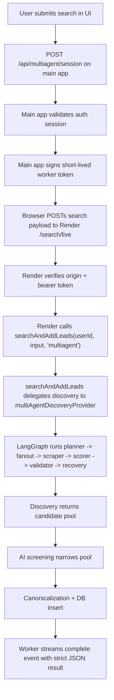

# Multi-Agent System

This document describes the current `multiagent` lead-search system end to end: how the browser starts a run, how the dedicated Render worker authenticates and streams it, how the LangGraph discovery graph works internally, and how the final leads are screened and persisted.

The implementation is split across:

- `src/components/search/SearchForm.tsx`
- `src/app/api/multiagent/session/route.ts`
- `src/lib/multiagent-service-auth.ts`
- `services/multiagent-service/server.ts`
- `src/server/services/search.ts`
- `src/lib/x/multiagent.ts`
- `src/lib/x/multiagent-types.ts`
- `src/lib/x/multiagent-trace.ts`

## 1. High-Level Goal

The system is built to find **targeted promotion leads** on X — people who would potentially interact with, repost, or promote content about a specific niche in exchange for payment. Example queries:

- `"product designers working in startups"`
- `"fintech founders"`
- `"AI engineers building in public"`

The system's core principle is **relevance over reach**: a 2k-follower creator who actively discusses the niche and shows engagement behavior is far more valuable than a 200k-follower account that never engages with the topic. Follower count is only a pre-filter (minimum threshold), never a scoring signal or evidence.

It does not rely on one search call. Instead, it runs a bounded supervisor-style workflow that:

1. Interprets the search goal to understand the essence of the ideal lead — who they are, what their bio says, how they engage.
2. Plans discovery queries targeting engaged niche participants (bio identity + engagement behavior).
3. Fans those queries out to Tavily with advanced search depth.
4. Scrapes discovered X profile URLs with AgentQL (profile + tweets).
5. Scores candidates purely by niche relevance: topic overlap, bio alignment, post evidence, creator signals, engagement willingness. Follower count = 0 score contribution.
6. Extracts concrete evidence: exact bio quotes, post excerpts with engagement stats, handle identity signals.
7. Validates whether the graph has enough candidate coverage.
8. Either terminates or enters a recovery lane and retries with adjusted parameters.

The graph is implemented with `@langchain/langgraph`. The model wrapper used by the planner is `@langchain/openai`, but orchestration, branching, fanout, recovery, and termination are owned by LangGraph.

## 2. Architectural Split

The multi-agent system is intentionally split into two runtime layers:

- Main web app on Vercel
- Dedicated `multiagent` worker service on Render

The reason for the split is operational, not logical. The browser-facing lead-search flow is the same, but long-lived streaming discovery now runs outside the Vercel request-duration envelope.

### What stayed the same

- The core lead-search function is still `searchAndAddLeads(...)`.
- The strict NDJSON event contract is preserved.
- The frontend still receives step-by-step reasoning and graph snapshots.
- Final results are still inserted into the same project and database tables.

### What changed

- The browser no longer depends on a single long-running Vercel route for `multiagent`.
- The browser requests a signed worker session from the main app.
- The browser then opens the live NDJSON stream directly to the Render worker.

## 3. End-to-End Request Lifecycle

## 4. Frontend Flow

The user starts from `SearchForm`.

### Step 1: Get stream target

`SearchForm.tsx` calls:

- `POST /api/multiagent/session`

That route decides whether the run should use:

- local mode: stream back to the app
- external mode: stream directly to the dedicated worker

In the current deployed architecture, `multiagent` uses external mode whenever `MULTIAGENT_SERVICE_URL` is configured.

### Step 2: Open live stream

The browser then sends the original search payload to the worker:

- `query`
- `projectId` or `projectName`
- optional `followerUsername`
- `minFollowers`
- `targetLeadCount`

The frontend parses newline-delimited JSON events and updates three pieces of UI state:

- `streamSteps`: human-readable reasoning steps
- `streamSnapshot`: graph progress snapshot
- `streamTrace`: final run trace after completion

### Event types

The stream uses a strict schema and emits four event types:

- `step`
- `snapshot`
- `complete`
- `error`

`step` events are descriptive reasoning entries.  
`snapshot` events update the live graph state.  
`complete` carries the final persisted search result.  
`error` carries a normalized failure message.

If the stream closes without `complete` or `error`, the frontend treats that as a transport failure.

## 5. Session Handoff and Worker Authentication

The route `src/app/api/multiagent/session/route.ts` is responsible for minting a short-lived worker token.

### Session route responsibilities

1. Validate the signed-in web session using the app auth layer.
2. Read `MULTIAGENT_SERVICE_URL`.
3. If the external worker is configured, sign a token that includes:
   - `sub`: user id
   - `iss`: `skaledotai-web`
   - `aud`: `skaledotai-multiagent-service`
   - `provider`: `multiagent`
   - `exp`: expiry timestamp
   - `origin`: optional frontend origin
4. Return:
   - external stream URL
   - bearer token
   - expiration timestamp

The token is HMAC-signed with `MULTIAGENT_SERVICE_SHARED_SECRET`.

### Worker-side checks

`services/multiagent-service/server.ts` verifies:

- the request origin is allowed by `MULTIAGENT_ALLOWED_ORIGINS`
- the bearer token exists
- the token signature is valid
- the token has not expired
- the token origin matches the request origin when origin is embedded

This design keeps the worker stateless. The worker does not need the web app’s auth cookies; it only needs a short-lived signed assertion from the main app.

## 6. Render Worker Responsibilities

The Render worker exposes a small HTTP surface:

- `POST /search/live`
- `GET /healthz`

The worker is a thin transport layer. It does not reimplement the search logic. Its responsibilities are:

1. Handle CORS.
2. Verify worker auth.
3. Parse the search payload with the same schema used by the app.
4. Call:
   - `searchAndAddLeads(userId, input, "multiagent", progressHandlers)`
5. Stream progress events as NDJSON.
6. Emit a final `complete` or `error` event.
7. Log compact reasoning/milestone events for Render observability.

The worker is intentionally thin so that the search logic remains centralized and behavior stays aligned with the original in-app implementation.

## 7. Core Search Orchestration

The main orchestration entrypoint is:

- `searchAndAddLeads(...)` in `src/server/services/search.ts`

This function owns the full lead-search pipeline:

1. Resolve or create the destination project.
2. Run discovery.
3. Build a screening pool.
4. Run AI screening.
5. Canonicalize profile rows.
6. Insert leads into the project.
7. Record the project run.
8. Build the final trace returned to the UI.

### Discovery ownership

Discovery is the only part that behaves differently by provider.

For most providers, the service layer owns the retry loop.  
For `multiagent`, the provider owns its own loop internally through LangGraph.

That distinction is important:

- non-`multiagent` providers: service-level bounded retry
- `multiagent`: provider-level graph with its own retries, recovery, and termination

### Candidate goal vs target lead count

The user may ask for `~40` final leads. The system deliberately over-fetches discovery candidates before screening.

It computes:

- `targetLeadCount`: desired final lead count (soft target, not a hard cap)
- `goalCount`: desired discovery candidate count
- `parseAccountsTarget`: candidate parsing budget
- `minFollowers`: minimum follower threshold (multiples of 1000) — used only as a pre-filter, never as a scoring signal or evidence

This separation exists because discovery must usually gather more raw candidates than the final lead target in order to survive filtering and screening. The target is approximate — if more relevant leads pass evidence-based screening, they are all kept.

## 8. Discovery Provider: LangGraph-Owned Loop

The `multiagent` discovery provider lives in `src/lib/x/multiagent.ts`.

Its exported provider is:

- `multiAgentDiscoveryProvider`

Its exported generic client wrapper is:

- `multiAgentClient`

The discovery provider compiles and executes a LangGraph state machine whose state includes:

- request metadata
- current attempt and limits
- query budget
- scrape batch size
- current and planned queries
- discovered URLs
- processed URLs
- scraped payloads
- scored candidates
- final candidate set
- accumulated error records
- recovery state
- stop reason
- trace-only fields for UI logging

The graph streams both:

- `updates`
- `values`

Those are converted into:

- trace steps for the reasoning panel
- live snapshots for the graph/metrics panel

## 9. State Model

The LangGraph state tracks both business state and observability state.

### Core control fields

- `attempt`
- `maxAttempts`
- `queryBudget`
- `scrapeBatchSize`
- `plannerMode`
- `recoveryState`
- `stopReason`

### Search material

- `plannedQueries`
- `currentQueries`
- `candidateUrls`
- `processedUrls`
- `repairUrls`
- `scraped`
- `scored`
- `candidates`

### Trace fields

- `activeNode`
- `completedNodes`
- `traceQuery`
- `traceBatchUrls`
- `recoveryNote`
- `firstPassCount`
- `lastAttemptYield`
- `plannerFallbackUsed`
- `errors`

Reducers are used to merge partial state updates safely when parallel branches return results. That matters because the graph uses `Send` fanout, so multiple branches can update shared state in the same run.

## 10. Node-by-Node Graph Behavior

The current graph is:

1. `planner`
2. `source_fanout`
3. `scrape_router`
4. `scraper`
5. `scorer`
6. `validator`
7. `recovery`

### 10.1 Planner

The planner is responsible for deciding which search queries should be used for the current attempt. It consists of two subagents:

#### Goal Interpreter subagent

The goal interpreter analyzes the search query to understand the **essence of the ideal lead** — a person who is actively engaged in the niche and would interact with, repost, or promote content for payment. It extracts:

- **roleTerms**: who these people are (e.g. "product designer", "founder", "engineer")
- **bioTerms**: what their bio would mention, including behavioral terms like "building", "shipping", "writing about", "obsessed with"
- **geoHints**: optional location signals
- **antiGoals**: account types to avoid (support, official, brand, institution, dormant, bot)
- **userGoals**: short descriptions capturing the essence of the ideal lead for this niche, emphasizing relevance and engagement behavior over follower count

The prompt explicitly states that a 2k-follower founder who actively discusses the niche is far more valuable than a 200k-follower account that never engages.

#### Dork Planner subagent

Generates Google dork queries and heuristic queries that target **engaged niche participants**, not just large accounts. Query patterns include:

- Bio-focused dorks: `site:x.com "niche" ("building" OR "founder" OR "creator")`
- Engagement-focused dorks: `site:x.com "niche" ("thread" OR "repost" OR "recommend")`
- Identity dorks: `site:twitter.com "niche" ("I build" OR "my project" OR "my startup")`
- Escalation dorks (later attempts): `"collab" OR "DM me" OR "open to"`, `"indie" OR "bootstrapped"`, `"just shipped" OR "check out"`

Heuristic queries target: "people who repost share and engage", "engaged community members", "indie makers operators shipping building".

Inputs include:

- niche/query text
- optional seed handle
- target lead count
- goal count
- attempt number
- query budget
- recovery state
- previously planned queries

#### Planner model

The planner uses OpenAI via `ChatOpenAI` with:

- model: `MULTIAGENT_PLANNER_MODEL` or `OPENAI_MODEL` or `gpt-5`
- reasoning effort: `medium`

Structured output is enforced with `QueryPlanSchema`.

#### Planner timeout

The planner is wrapped in a hard timeout controlled by:

- `MULTIAGENT_PLANNER_TIMEOUT_MS`

The default is currently `45000ms`, with an allowed ceiling of `120000ms`.

#### Planner fallback behavior

If the planner fails, times out, or returns unusable structured output, the system does not abort immediately. It falls back to heuristic query generation.

The planner can also intentionally switch modes:

- `initial`
- `expansion`
- `repair`
- `throttle`

Those modes are driven by recovery state:

- `low_yield` -> expand query breadth
- `json_repair` -> rely on deterministic heuristic queries
- `rate_limited` -> reduce breadth and back off

### 10.2 Source Fanout

`source_fanout` runs one branch per query.

This node uses Tavily search (advanced depth) to discover candidate X profile URLs related to each planned query.

Responsibilities:

- execute Tavily search with `search_depth: "advanced"` for higher quality results
- normalize URLs
- enforce a bounded URL budget
- attach query-scoped errors if Tavily fails

This node does not scrape profiles directly. It only produces candidate profile URLs.

### 10.3 Scrape Router

`scrape_router` is a graph-routing node, not a data-extraction node.

Responsibilities:

- prioritize `repairUrls` when recovery wants specific failed URLs retried
- combine them with newly discovered URLs
- exclude already processed URLs
- enforce URL limits
- batch URLs into scrape groups
- emit one `Send("scraper", ...)` per batch

This is the map-reduce fanout stage for scraping.

### 10.4 Scraper

`scraper` runs one branch per URL batch.

It uses AgentQL to extract profile **and tweet** payloads from X URLs using `profile_with_tweets` mode. This ensures the pipeline gets both bio content and recent post content for evidence extraction and relevance scoring.

Responsibilities:

- call AgentQL with bounded concurrency in `profile_with_tweets` mode
- accumulate raw payloads containing profile data + up to 5 recent tweets
- record processed URLs
- attach per-URL error records when a scrape fails

Failures here do not necessarily kill the run. They become structured error records that the validator can use to route the graph into recovery.

### 10.5 Scorer

`scorer` converts normalized scraped profiles into heuristic candidate scores.

It does not call a model. Scoring is deterministic and cheap.

**Relevance-first scoring formula** (0-100 clamped):

| Signal | Max points | Description |
|--------|-----------|-------------|
| Topic relevance | 35 | Niche keyword hits across bio + posts (`topicalHits * 7`) |
| Bio relevance | 15 | Niche keywords found specifically in bio (`bioHits * 5`) |
| Engagement behavior | 20 | Log-scaled from likes, replies (x3 weight), reposts (x4 weight), views |
| Active post signal | 12 | Posts that discuss niche keywords (`postHits * 4`), or 3 if posts exist but don't match |
| Creator bio bonus | 6 | Bio contains creator/operator terms (founder, building, shipping, indie, freelance, etc.) |
| Engagement willingness | 5 | Posts show reposting/collaboration behavior (RT, thread, collab, recommend, etc.) |
| **Follower count** | **0** | **Not a scoring signal — only a pre-filter** |

Penalties:

| Penalty | Points | Trigger |
|---------|--------|---------|
| Handle penalty | -20 | Handle contains support/official/news/hq/team |
| Brand penalty | -16 | Bio contains official/support/newsroom/company/inc/labs/hq |

The score is clamped to `0-100`, and the node also stores human-readable reasons such as:

- niche keyword hits across bio/posts
- bio directly mentions niche terms
- recent posts discuss the niche
- bio signals individual creator/operator
- posts show reposting/engagement behavior
- active engagement signals
- brand or support-account penalty applied

**Evidence extraction** runs alongside scoring and produces concrete proof of niche relevance:

- **Bio evidence**: exact bio quotes showing niche identity + creator/operator signals
- **Post evidence**: exact post excerpts with engagement stats (likes, reposts, replies) proving active niche participation
- **Engagement behavior evidence**: posts showing reposting, threading, collaboration, or recommendation behavior
- **Handle evidence**: niche keywords found in the handle itself

No follower-based evidence is generated. Audience size never appears as a reason for inclusion.

### 10.6 Validator

`validator` is the graph’s decision node.

It decides whether the workflow:

- terminates successfully
- terminates because the budget is exhausted
- enters recovery and retries

The validator keeps ALL scored candidates without capping at `goalCount` — more relevant leads = better. It computes:

- sorted candidate pool (sorted by relevance score, then evidence count, then post count — never followers)
- attempt yield
- attempt-scoped errors
- whether goal count is satisfied (determines whether to retry, not whether to cap)
- whether all current work is exhausted
- whether recovery is needed

#### Stop reasons

- `goal_reached`
- `max_attempts`
- `query_exhausted`

#### Recovery states

- `low_yield`
- `rate_limited`
- `json_repair`

The validator is where the graph’s bounded-search policy is enforced.

### 10.7 Recovery

`recovery` prepares the next attempt without losing accumulated knowledge.

It adjusts:

- `attempt`
- `queryBudget`
- `scrapeBatchSize`
- `currentQueries`
- `plannerFallbackUsed`
- `recoveryNote`
- `traceBatchUrls`

Its policy is:

- `low_yield`: expand search breadth
- `rate_limited`: reduce query breadth and cut scrape batch size
- `json_repair`: keep the graph deterministic and shrink scrape batches

After recovery, control returns to `planner`.

## 11. LangGraph Routing Rules

The graph uses conditional routing rather than a fixed linear chain.

### Planner exit

From `planner`:

- if `currentQueries` exists: fan out to `source_fanout`
- else if `repairUrls` exists: route to `scrape_router`
- else: route to `validator`

### Scrape router exit

From `scrape_router`:

- if there are scrape batches: fan out to `scraper`
- else: route to `scorer`

### Validator exit

From `validator`:

- if `stopReason` exists: terminate
- else: go to `recovery`

This is what makes the system a genuine graph rather than a simple pipeline.

## 12. Bounded Search Strategy

The system is intentionally not open-ended. It is designed to search aggressively but within strict bounds.

Boundaries include:

- maximum attempts
- query budget
- URL limit
- scrape batch size
- candidate goal
- planner timeout

This gives the system two important properties:

1. It is resilient enough to recover from partial failures.
2. It is predictable enough to operate in production without unbounded cost growth.

## 13. Error Model

The graph records structured stage errors instead of only throwing raw exceptions.

Each error record includes:

- `stage`
- `attempt`
- `code`
- `message`
- optional `query`
- optional `url`

Tracked stages are currently:

- `planner`
- `source_fanout`
- `scraper`

These records serve two purposes:

1. They drive graph routing, especially into recovery.
2. They make failure summaries more actionable than a generic upstream failure.

If the workflow ends with zero candidates and accumulated stage errors, the provider throws a normalized `XProviderRuntimeError` summarizing the recent stage failures.

## 14. After Discovery: Screening and Persistence

Discovery does not directly decide the final leads inserted into the project.

After discovery completes, `searchAndAddLeads(...)` continues with additional stages outside the graph.

### 14.1 Screening Pool Build

ALL discovered candidates are sent to AI screening with no artificial cap. Candidates are sorted by relevance (post count > bio length > followers as last tiebreaker) and prioritized: candidates with posts first, then substantive bios, then discovery source variety.

The philosophy is: more relevant leads = better. The AI screener handles rejection, not a pre-screening cap.

### 14.2 AI Screening

The screening stage calls:

- `screenProfilesForLeadSearchDetailed(...)`

This model-driven stage decides which discovered candidates are genuinely relevant to the exact niche described in the query. The screening prompt enforces strict evidence-based decisions:

- **ONLY include** a profile if specific bio/post text directly references the query’s core topic
- **Follower count is NOT evidence** — it is explicitly excluded from reasoning. Profiles below the minimum follower threshold have already been removed before screening
- Scoring requires exact bio/post quotes as proof: 80-100 (bio AND posts), 60-79 (bio OR posts), 40-59 (at least one clear reference), 0/reject (no specific evidence)
- Vague connections, adjacent industries, or generic terms do NOT count as evidence
- **No artificial result cap** — all leads that pass screening are kept. More relevant leads = better

This is separate from graph scoring:

- graph scoring: deterministic relevance ranking to stabilize discovery
- AI screening: evidence-based lead-fit selection requiring exact bio/post proof

### 14.3 Canonicalization

The selected candidates are canonicalized into stable lead rows. This stage resolves profile details into the shape used by the rest of the application.

### 14.4 Insert

The final rows are inserted into the target project.

### 14.5 Run recording

The system records the search run with provider metadata so the application can retain a consistent audit trail of:

- requested provider
- discovery provider
- lookup provider
- query
- seed username
- lead count

## 15. Streaming and Frontend Reasoning

One of the system goals is observability, not just final results.

The graph therefore emits two parallel observability outputs:

### 15.1 Trace steps

Each important node update is converted into a `ProjectRunTraceStep`.

These are the reasoning cards shown in the frontend and now also summarized in Render logs. They explain things such as:

- which query the planner generated
- how many URLs fanout resolved
- how many payloads the scraper produced
- how candidates were scored
- whether the validator hit the goal or triggered recovery

### 15.2 Stream snapshots

The provider also emits compact live snapshots that drive the progress graph and counters in the UI.

Those snapshots include:

- active node
- completed nodes
- attempt/max attempts
- recovery state
- stop reason
- counts for queries, URLs, scraped payloads, and candidates

This is how the frontend can render the animated multi-agent graph rather than only showing final logs.

## 16. Render Logging Model

The worker logs the run in a compact way so the Render console reflects what the user sees in the UI without dumping the entire NDJSON stream.

Key log families:

- `[multiagent-service][request]`
- `[multiagent-service][search-live] accepted`
- `[multiagent-service][trace-step]`
- `[multiagent-service][trace-snapshot]`
- `[multiagent-service][search-live] complete`
- `[multiagent-service][search-live] error`

This gives three levels of visibility:

1. transport visibility: request accepted or rejected
2. reasoning visibility: major step summaries
3. outcome visibility: final completion or failure

## 17. Environment Variables

### Main app

- `MULTIAGENT_SERVICE_URL`
- `MULTIAGENT_SERVICE_SHARED_SECRET`

### Render worker

- `DATABASE_URL`
- `OPENAI_API_KEY`
- `TAVILY_API_KEY`
- `AGENTQL_API_KEY`
- `MULTIAGENT_SERVICE_SHARED_SECRET`
- `MULTIAGENT_ALLOWED_ORIGINS`
- optional `OPENAI_MODEL`
- optional `MULTIAGENT_PLANNER_MODEL`
- optional `MULTIAGENT_PLANNER_TIMEOUT_MS`

### Important notes

- `MULTIAGENT_ALLOWED_ORIGINS` should contain exact origins, not paths.
- The shared secret must match exactly between the main app and the worker.
- If `MULTIAGENT_SERVICE_URL` is absent, the app can fall back to local mode.

## 18. Deployment Model

The dedicated worker is containerized and deployed separately from the main app.

The current Docker setup is designed to:

- build the service with Bun tooling
- run the built worker under Node

This keeps the worker close to the existing TypeScript runtime behavior while still isolating multi-agent execution from the main Vercel request path.

## 19. Why the System Is Built This Way

This architecture solves several real constraints at once:

- long-running discovery cannot reliably stay inside a single Vercel request
- discovery quality improves significantly when search is iterative and stateful
- scraping and URL expansion have highly variable latency and failure patterns
- the frontend needs live reasoning, not just a spinner

Putting the graph inside the provider gives the system a coherent control plane:

- the provider owns retries
- the provider owns recovery
- the provider owns proactive termination
- the rest of the search pipeline can remain relatively unchanged

## 20. Current Limitations

The system is production-oriented, but there are still deliberate simplifications:

- only the discovery phase is graph-owned; later stages remain service-owned
- planner model access is still mediated through `@langchain/openai`
- source fanout currently depends on Tavily for URL discovery
- scraper quality and latency depend on the structure of X profile pages and AgentQL extraction quality
- the screening stage is still separate from the graph rather than modeled as another graph sub-agent

These are acceptable tradeoffs for the current implementation because they keep the system bounded, observable, and operationally practical.

## 21. Practical Summary

In concrete terms, the multi-agent system works like this:

1. The browser asks the main app for a signed worker session.
2. The browser sends the original search request directly to the Render worker.
3. The worker verifies origin and token.
4. The worker calls the shared `searchAndAddLeads(...)` pipeline with provider `multiagent`.
5. Discovery is executed by a LangGraph state machine that plans, fans out, scrapes, scores, validates, and recovers until it either succeeds or exhausts its bounded budget.
6. The resulting candidate pool is AI-screened, canonicalized, and inserted into the destination project.
7. The worker streams the entire reasoning process and final result back to the browser.

That is the current multi-agent system as implemented.
